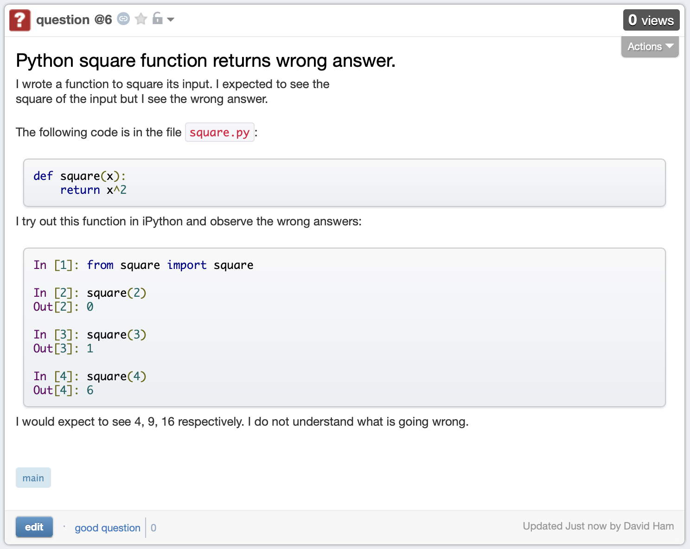

.. _introduction:

Introduction: abstraction in mathematics and programming
========================================================

.. dropdown:: Video introduction.

    .. container:: vimeo

        .. raw:: html

            <iframe src="https://player.vimeo.com/video/486106801"
            frameborder="0" allow="autoplay; fullscreen"
            allowfullscreen></iframe>

    Imperial students can also `watch this video on Panopto <https://imperial.cloud.panopto.eu/Panopto/Pages/Viewer.aspx?id=ee8cae7f-1b42-4db3-adc0-ac840144de53>`_

A core tool of mathematics is to define abstract objects and the
operations which apply to them. This approach defines all the basic
building blocks which enable us to reason mathematically and perform
calculations. We start off with basic objects like numbers and define
arithmetic operations on them. As we become more sophisticated, we
define more and more complex objects, with appropriately more involved
operations: matrices, polynomials, sets, groups, algebras. Being able
to reason at the level of abstract objects is essential in making
mathematics comprehensible. Consider matrices: linear algebra would be
highly impractical at best if we could not define matrix addition and
multiplication, and had instead to work directly with sums of products
of scalars. More generally, without abstraction the edifice of higher
mathematics would rapidly collapse under the weight of its own
complexity.

The situation in computer programming is strikingly similar. At the
simplest level, the central processing unit of a computer is capable
only of a limited set of rather primitive arithmetic and logical
operations on a few finite subsets of the integers, and of the
floating point numbers. However, on this tiny foundation is built
every piece of software in existence, including very sophisticated
programs for text manipulation, higher mathematics, sound and
video. Moreover, this software is routinely created by ordinary people
using relatively modest amounts of effort. How is this possible? It is
possible because of the same principle of abstraction which underpins
mathematics: more abstract objects and the operations on them are
defined in terms of simpler ones.

Think about plotting a graph on a computer. As a 21st century
mathematician you don't write loops over arrays to compute the pixel
values that will result in the right curve appearing on a screen, you
use a high-level language such as Python which has plotting objects
which take in data and perform all of those calculations for
you. Where did those plotting objects come from? They are the result
of the manipulation of lower-level abstract objects in a chain that
eventually ends up with primitive operations on integers and floating
point numbers. But, critically, as the person wanting to plot some
data *you don't care*.

Why, then, as a mathematician should you care about abstraction in
programming? There are two key reasons. First, because an
understanding of the abstractions on which software is built will give
you a better understanding of how that software works and will
therefore make you a better user of that software. The second is that
making appropriate use of abstractions will make you a better
programmer of mathematics and other software. Applied well, objects
and abstraction produce software which is easier to write, easier to
understand, easier to debug and easier to extend. Indeed, as with
abstraction in mathematics, abstraction in coding is a form of
constructive laziness: it simultaneously allows the mathematician to
achieve more and do less work.

This is a second course in programming, building a previously
acquired basic understanding of programming in Python. In covering
more advanced programming, we will pay particular attention to objects
and abstraction as they occur in Python. Furthermore, we will do so
from a mathematician's perspective, understanding programming as a
process of defining and manipulating mathematical objects, and
scientifically testing and debugging the results.

How to do this course
---------------------

Programming, like mathematics, is a practical, problem solving discipline. It's
not possible to learn to program just by reading notes and watching lectures. To
learn to program you need to put the content of the course into practice by
writing code. The structure of this course is designed to help you to really
understand new concepts in programming by putting them into practice. Each week,
we run through the same cycle:

1. Read the notes
2. Watch the videos
3. Do the quiz
4. Write the code

The notes
.........

All of the new material we cover in this course is presented in these notes.
Each chapter contains the material for one week of term, so in week :math:`n`,
you work through chapter :math:`n`. The notes always the starting point for your work.
Each chapter will introduce new concepts in programming, often tied back to
related mathematical concepts, and always illustrated by practical code
examples. Python has excellent `official online documentation
<https://docs.python.org/3/>`_, and we link to that throughout the text.
External links show up in orange while :ref:`internal links to other parts of
the notes <introduction>` are red. Sometimes we introduce counterexamples:
illustrations of code errors or bad implementation ideas. These will be flagged
with a big red cross:

.. container:: badcode

    .. code-block:: python3

        print "Hello World"

Conversely, if it's necessary in context to highlight which approach is the
correct one, the code will come with a big green tick:

.. container:: goodcode

    .. code-block:: python3

        print("Hello World")

At the end of each chapter there is a glossary containing key new concepts
introduced in that chapter. Always check the glossary and convince yourself that
you understand all the terms introduced there, this is a good check on whether
you have understood the chapter as a whole. However, there is more to learning
new concepts than just the vocabulary, so don't be tempted to skip reading the
chapter and just jump to the glossary!

The chapters broadly alternate between introducing new programming concepts,
such as :ref:`objects <objects>`, :ref:`abstract data types
<abstract_data_types>`, or :ref:`inheritance <inheritance>`, and
covering various aspects of the craft of programming, such as :ref:`style
<inheritance>` and :ref:`debugging <debugging>`. In this way the course combines specific programming knowledge
with more general coding skills.

The videos
..........

Throughout the notes are links to videos. These aren't typical lecture videos in
that they're not primarily focussed on delivering the new ideas in the course.
In particular, the videos don't set out to duplicate the delivery of the
material in the notes. Instead, the videos focus on putting the concepts into
practice, often by showing live coding sessions. Usually you'll want to watch
the video for a given section *after* reading the corresponding notes.

The quizzes
...........

Towards the end of each chapter is a link back to a quiz on Imperial's
Blackboard system. The quizzes are designed to allow you to convince yourself
that you've understood the material in the chapter. Sometimes they will simply
be multiple choice questions testing your understanding of the material, but
sometimes you will need to open up Python and try things out in order to work
out the right answer. The quizzes do not contribute to your module grade, but how
well you are doing on them is an indication of your progress on the module.

The exercises
.............

As we've already noted, really learning to program better is only achieved by
writing code. The core of each week's activities is therefore to put the new
concepts and programming structures you've learned into practice. The
programming exercises are given at the end of each chapter, just before the
glossary. Each time there will be a skeleton code available from
:ref:`GitHub Classroom <fons:github_classroom_exercise>` which provides the starting
point. Sometimes you might be asked to complete a piece of code while on other
occasions you'll need to write a whole Python module from scratch. Each set of
exercises will come with a matching set of tests. These are small programs which
check whether your code produces the correct responses to a range of inputs.
Tests like this provide immediate feedback and enable you to know how you are
doing without having to wait for code to be submitted and marked.

.. note::

    Solutions to exercises will not be issued. The notes and accompanying
    example code contain examples of the same programming constructs that the
    exercises require you to implement, and the tests provide a mechanism to
    know when you have a correct answer. There are also help mechanisms via the
    course forum and the lab sessions. Issuing solutions to problems would
    simply encourage students to study the solutions rather than write code, and
    the only way to learn to program is to write code.

Assessment
..........

The weekly quiz and exercises are not assessable: they are formative activities
designed to help you learn the module. Instead, the module will be assessed by
two controlled programming assessments, effectively programming exams. The first
programming assessment will be held in week 7 and will be worth 20% of the
marks for the course. This provides an opportunity to receive feedback in the
middle of the term, and is a practice for the main exam. The :ref:`course contents for
week 7 <midterm>` will comprise practice programming exercises for this midterm test.
The second programming assessment will be held in the main May exam period and
will count for the other 80% of the course.

The instructions and skeleton code for the programming exercises will be
released at a fixed time on GitHub Classroom, and the code which you have
committed to GitHub by the end of the allotted time will be marked.

The exam questions will be similar to the weekly exercises in the course,
and may include new programmes to write from specification, modifications or
extensions to be made to code which is provided, and debugging exercises in
which defective code is provided which you need to correct. Marks will be
allocated both for the functional correctness of the code written, and for
good style and following Python coding conventions.


Obtaining the right software tools
----------------------------------

In order to do this module, you'll need some core software tools. As the module
proceeds we'll also install several more Python packages, but you don't need to
install those right now. The core tools you will need are:

    1. Python version 3.6 or later.
    2. Git (the revision control system we're going to use).
    3. A Python-aware text editor. Visual Studio Code is recommended, and all
       the instructions in this course will assume that this is what you are using.

The Faculty of Natural Sciences at Imperial has 
:doc:`centralised instructions for installing all of these tools <fons:index>`, and we'll follow those. 

Python 
......

Follow the :doc:`FoNS Python instructions <fons:python>`. We will exclusively
use :ref:`virtual environments <fons:python_virtual_environments>` so it doesn't matter at
all whether you use Python from Anaconda or from another source. Mac users
should note, though that the built-in Python will not do, so you should use
either Homebrew or Anaconda.

.. note::

    The example code in the exercises uses :ref:`f-strings <tut-f-strings>`
    which were introduced in Python 3.6, so the code will not work in earlier
    versions of Python.

Git
...

Git is a revision control system. Revision control systems enable you to keep
track of the different versions of a piece of code as you work on them, and to
have these versions on different computers as well as backed up in the cloud. We
will use Git and GitHub classroom as a mechanism for distributing, working with
and submitting code exercises.

.. warning::

    When you come to the assessable programming tests that make up 100% of the
    assessment for this module, the code will be distributed and submitted using
    Git. It is therefore essential that you incorporate Git into your day to day
    workflow so that when you come to the test, it's second nature. You will not
    receive marks for test answers that are not committed and pushed.

Visual Studio Code
..................

Visual Studio Code is a Python-aware Integrated Development Environment (IDE).
This means that it incorporates editing files with other programming features
such as :ref:`debugging`, Git support, and built-in :ref:`terminal
<terminal-vscode>`. Visual Studio Code also provides an incredibly useful remote
collaborative coding feature called Live Share. This will be very useful for
getting remote help from an instructor. 

Getting help
------------

.. _issue-report:

Writing an issue report
.......................

It is very likely that you will get stuck and need help during this module.
Going forward, it is also likely that you will at some point find a programming
problem you can't solve, or will find what you believe to be a bug in a piece of
software you rely on. In these circumstances, you need to be able to ask for
help, in writing, in some sort of online forum. There is a skill to doing this,
and doing it well will help others to help you - which radically increases the
chance that you will quickly get a solution to your problem.

The following sections explain the content that should (and sometimes shouldn't)
be in every issue report. You should get into the habit of thinking through all
of these stages every time you raise an issue. If the issue report is short then
there is no need to explicitly highlight each of these stages, so long as the
information is there. For a longer or more complex issue, it can make the issue
easier to read if you actually include these steps as subheadings.

Title 
.....

The title of the issue, which might go in the subject line of an email or a
forum post, should be a very short (10 word) outline of the key problem you
observe. Examples might include:

    command not found when starting Python

    inverting matrix results in FloatingPointError

    Incorrect values from MyClass.somemethod() for complex inputs

What these titles have in common is that they (very briefly) contain both what
the user was doing, and what went wrong. This is enough for someone reading the
title to have a picture of what sort of thing the user was doing, and what seems
to have gone wrong.

Notice that the titles do not need to be full sentences (there are no verbs in
any of them), but they are precise about what the user was doing, naming the
exact operation and error observed.

Steps to reproduce
..................

Next, it's very important to establish exactly what has happened. This is
essential both for the understanding of the people trying to help, and to enable
them to recreate the problem themselves. It doesn't need to be particularly
long, but it does need to be complete, in the sense that someone else reading
your description have enough information to know what you did and (all else
being equal), hit the same problem. The steps to reproduce can themselves be
divided into categories:

relevant system information
    The key word here is *relevant*. For example if you're having trouble running
    Python itself, then which Python you installed on which operating system is
    very relevant. On the other hand if Python is running just fine but you're
    hitting an :term:`exception` that you don't understand, then it probably
    doesn't matter which operating system you are running.

which code failed
    Were you working on a particular exercise, which one? How would the helper
    find your code? If it's code that you have edited, then unless you have
    committed and pushed the changes, there is no way for a helper to get access
    to the code you actually ran, so they will be flying blind. Avoid attaching
    large amounts of code to issues, it's difficult for helpers to work with, or
    even to run in exactly the same way you did. It's much better to be able to
    point to a complete repository. Of course an even better approach is to construct a
    :ref:`minimal failing example <debugging-mfe>`.

what did you actually do?
    This is one point where running code from the terminal is a major advantage,
    because you can simply copy and paste everything you typed into the issue.
    Explaining precisely what you did with a graphical interface is much harder,
    and requires particular attention to detail. Remember that the person
    reading your issue report can't see what you can see, so if you skip over
    steps then they might not even be able to see the thing you say you clicked
    on!

It's important that the description of what you did is strictly a factual
historical record. This is not the time to speculate about what you think is
going wrong, we'll get to that bit. Here you're strictly repeating what you did.

.. note::

    Please avoid posting substantially complete solutions to programming
    exercises into the course forum. Instead, ensure that you have :ref:`pushed
    your work to Github <fons:commit_push>`, and then post the :ref:`git commit
    hash <fons:git-hash>`. This will enable the lecturer or TA to find your
    code. It is still important to include all of the other components of the
    issue report.

Observed result
...............

The next stage is to describe what happened. Again, this is strictly a reporting
stage. You report your observations and only those. If there is textual output,
then include all of it. It's a very common failing for issue reports to only
contain the part of the output that the reporter thought was relevant, omitting
a whole load of essential information whose importance the reporter did not
realise.

If the problem is in the visual appearance of a graphical output, for example a
graph with invalid layout, then it would be appropriate to attach an image. 

Expected result
...............

This is the first point at which you are no longer simply a reporter of observed
facts. Sometimes the expected result is completely obvious: you observed an
error and you expected that the code would run correctly. However in other
circumstances there might not be an error but the result might not be what you
expect. Regardless of which of these is the case, you should include some sort
of statement of what you were expecting to have happen. This is for two reasons,
the first is that the mere fact of stating the question like this forces you to
think about what the core question you are asking is. This will help you write a
focussed issue report which is easier for your helpers to respond to. The second
is that a statement of what you think that the outcome should be can help
someone reading the issue report to understand the question you are asking, and
therefore that they should answer.

Any other information
.....................

Finally, you should add any other information you think is relevant. For example
if you think you have an idea about what is going on, then put it in here.
Alternatively if you've searched for the error online and think you've found
relevant information then include this here.

Issue pitfalls
..............

Many issue reports suffer from a few common failings. A lot of these come down
to not providing enough or precise enough information for those who might help
to actually do so. Always remember that the people you are asking for help
haven't seen what's on your screen, and don't know what have done. You therefore
need to spell things out for them in quite exacting detail.

Be precise
~~~~~~~~~~

Rather than just say that you got an error, state exactly which type or, if you don't
know, then repeat exactly what was printed out. Exactly which tool were you
using? Did a Python error occur in a particular script, or was it the result of
something you typed into the Python command line? 

Don't leap to conclusions
~~~~~~~~~~~~~~~~~~~~~~~~~

Very often you will have an idea about what has gone wrong. This is important
information, and you should include it in your issue report, however don't let
it distract you from providing a precise and complete description of what
happened. If you've not been able to fix the issue yourself, then you can't
exclude the possibility that you might not understand what it is that has gone
wrong. For this reason, you should always include everything you did and the
entirety of any error message, even if you don't think it's relevant to the
error.

Avoid "it"
~~~~~~~~~~

"It doesn't work" is every software developer's least favourite
issue report. When describing the programs and data that you are using, you have
a mental model of what you are working with. The reader of your issue does not
share this model, so when you use pronouns such as "it" then the reader
frequently has no idea what "it" is that you are referring to. If you know which
program failed, then name the program explicitly. If you don't then simply but precisely describe
what you observed.

Avoid screenshots of text
~~~~~~~~~~~~~~~~~~~~~~~~~

If the input and/or output of the operation which caused the issue are text,
then copy and paste that text into the issue. Do not insert a screenshot. There
are many reasons why screenshots are inferior to copying and pasting the text:

1. You don't know what screen the reader will be on. Screenshots can very easily
   end up very hard to read.
2. The reader can't search the text in a screenshot for particular words or
   phrases they need to find to diagnose your error.
3. The reader may well want to copy exactly what you typed in order to try to
   reproduce the error. They can't do that from a screenshot.
4. It is very easy for a screenshot to miss important information. For example
   many error messages are quite long, and part of the error may well have scrolled
   out of view.

The only time when it is appropriate to include a screenshot is when the output
is graphical and you need to illustrate why something looks wrong.

Writing an issue report in Markdown on Piazza
.............................................

Web fora are often optimised for making prose easy to read, so the forum will do
things like change indentation or the location of linebreaks in order to make a
nice paragraph of text in whichever area is available on the reader's screen.
This is great for prose, but absolutely disastrous for code or computer output,
because changing the linebreaks and other whitespace turns carefully formatted
information into scrambled junk. To overcome this, it is necessary to tell the
forum which parts of the text are prose, which are code, and possibly other
information (for example, you might want to add a mathematical formula). 

In order to support this, many web fora support some form of markup language. A
markup language represents the structure of the contents of a body of text by
inserting special instructions, called markup, into the text. You've already
learned one of these systems, because `LaTeX <https://www.latex-project.org>`__ is a markup system. The notes for
this course are written in `reStructuredText <https://docutils.readthedocs.io/en/sphinx-docs/user/rst/quickstart.html>`__,
which is another markup language. Many web fora, notably Piazza and GitHub, use
variants of another markup language called Markdown (computer scientists are
regrettably fond of poor puns when naming projects). Since we use Piazza in this
course we'll look at how to use a little Markdown to make your issue reports
much more readable. It's important to know that Markdown is not a standardised
language, so the exact functionality available depends somewhat on which forum
you are using Markdown for. For example GitHub doesn't support typesetting maths
from Markdown.

Setting the Piazza editor to Markdown
~~~~~~~~~~~~~~~~~~~~~~~~~~~~~~~~~~~~~

When you create a new post or reply to an existing one on Piazza, the editor
which opens presents three options. Some, but not all, of the code formatting
and highlighting functionality is available via the :code:`Rich text editor`
option, which is a graphical editor more similar to Microsoft Word, so it's
better to choose :code:`Markdown editor`. 

.. image:: images/piazza_editor_choice.png
    :width: 50%
    :align: center
    :alt: Image of Piazza web editor options with Markdown editor selected.

Including code, input, and output
~~~~~~~~~~~~~~~~~~~~~~~~~~~~~~~~~

Code, commands you type at the terminal prompt, and output printed in the
terminal or in IPython are treated almost exactly the same way. The best
approach is to use what Markdown calls a "fenced code block". This means that
you put the code between "fences" comprising three backquotes on a
line by themselves. For example::

    ```
    $ cd myfolder
    $ python myscript.py
    ```

If the code in question is written in a language that the Markdown interpreter
knows about, and this is indicated at the end of the first fence, then the
syntax will be highlighted to make it easier to read::

    ```python3
    print("Hello World!")
    ```

This results in something like:

.. code-block:: python3

    print("Hello World!")

Similarly, you can mark the first fence with `ipython3` to indicate that the
code following is copied and pasted from an IPython command line. If you need to
include code inline in text, then you just contain it in single backquotes:
`\`some_code\``.

Including mathematics
~~~~~~~~~~~~~~~~~~~~~

Any text contained between delimiters comprising double dollar signs will be
passed to LaTeX and rendered as maths. For example, `$$x^2$$` will be rendered
as :math:`x^2`. 

Including links
~~~~~~~~~~~~~~~

Just dumping URLs into the text often results in hard to read code. Instead,
Markdown enables you to write the link text in square brackets followed by the
URL in round brackets. So `[the Markdown Cheat
Sheet](https://www.markdownguide.org/cheat-sheet/)` becomes `the Markdown Cheat
Sheet <https://www.markdownguide.org/cheat-sheet/>`__.


More advanced Markdown
~~~~~~~~~~~~~~~~~~~~~~

There are many other Markdown features that can be useful in longer posts, and
there are many resources about Markdown available online. `The Markdown Guide
<https://www.markdownguide.org>`__ is a good place to start.

An example issue report
.......................

A fairly short and simple issue report which includes all of the relevant
information, might be written in Markdown as follows. The title, which we omit
from the Markdown because it would be typed in a separate box on Piazza, might
be something like "Python square function returns wrong answer." 

.. code-block:: md

    I wrote a function to square its input. I expected to see the
    square of the input but I see the wrong answer.

    The following code is in the file `square.py`:

    ```python3
    def square(x):
        return x^2
    ```

    I try out this function in iPython and observe the wrong answers:

    ```ipython3
    In [1]: from square import square

    In [2]: square(2)
    Out[2]: 0

    In [3]: square(3)
    Out[3]: 1

    In [4]: square(4)
    Out[4]: 6
    ```

    I would expect to see 4, 9, 16 respectively. I do not understand what is
    going wrong.

This results in the following, much more readable, post on Piazza:



.. note::

    The point of this example is to illustrate how to write an issue report.
    However, you do actually know enough Python from your previous introductory
    course to work out what's wrong with the code here. Can you see what the
    problem is?


Exercises
---------

This week's exercises are designed to ensure that you are set up with the core
tools that you will need for the rest of the module. Exceptionally, there is no
quiz this week as we haven't yet started with the substantive contents of the
module. Nonetheless, this week's exercises are an important baseline. Skipping
them is likely to result in you having to play catchup in the coming weeks.

.. proof:exercise::
    
    Install Python using  the :doc:`FoNS Python installation instructions <fons:python>`.

.. proof:exercise::

    Install Git and work through the entire Git, GitHub, and GitHub Classroom
    tutorial on the :doc:`FoNS Git instructions webpage <fons:git>`.

.. proof:exercise::

    Install Visual Studio Code using the :doc:`FoNS Visual Studio Code
    installation instructions <fons:vscode>`.
    
.. proof:exercise::

    With one or two friends from the class, follow the  
    :ref:`Live Share instructions <vscode-liveshare>`. 
    Ensure that each of you can start a Live Share session and have the other
    successfully join, and that all of you can edit files.
