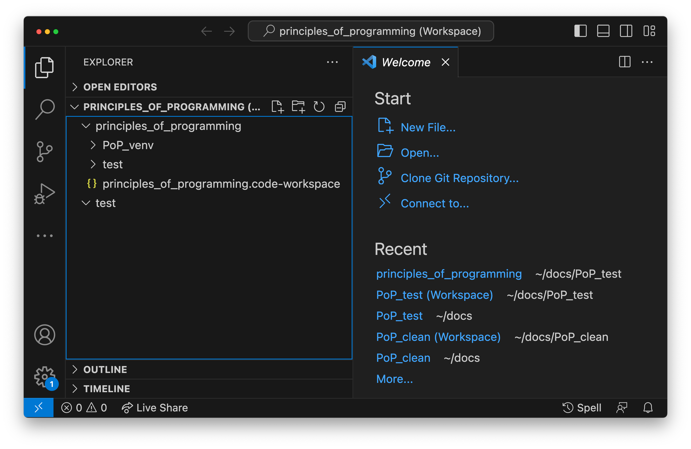

.. _programs_files:

Programs in files
===================

In this chapter we will start to learn how to combine pieces of code into
larger units, and how to package up your code so that you or others can do the
same. You may previously have written Python code in Jupyter notebooks, and
possibly used an interactive Python environment such as IPython. Jupyter
notebooks are an excellent platform for writing and documenting short pieces of
code. However, they are much less good for writing code which is designed to be
used by other people. If the intention is to write mathematical building blocks
out of which more complex algorithms can be constructed, then we need a
different way of storing code: one which is accessible in more automated ways
than typing in a web browser. As an introduction to writing code in files, we
will first consider Python scripts. We'll then move on to making code really
reusable by creating Python modules and packages.

The Python interpreter
----------------------

.. details:: Video: a first Python script.

    .. vimeo:: 486557682

    .. only:: html

        Imperial students can also `watch this video on Panopto <https://imperial.cloud.panopto.eu/Panopto/Pages/Viewer.aspx?id=8773e5b7-a331-4ca3-a59d-ae1c00da3b4f>`__

Before we dive into the various different ways that Python code can be
organised and run, it's helpful to have a mental model of what it actually
means for Python code to execute. Python is an interpreted language. This means
that the program that runs is not made up of the primitive machine-level
instructions that the processor in your computer executes. Instead, the Python
program is read and executed by another piece of software, the Python
interpreter. The Python interpreter takes a sequence of Python statements and
performs the actions they specify. The interpreter takes care of allocating the
required memory and causes the right sequences of primitive machine-level
instructions to execute on the actual hardware such that your programme runs.

The Python interpreter is the same no matter whether you use Jupyter
notebooks, an interactive Python terminal such as IPython, or execute
code written in Python scripts. These are all just different ways of
providing a sequence of Python commands to the interpreter, and
conveying the output back to the user. This means that the same Python
code works in essentially the same way no matter how you use
Python. The Python interpreter also sits between the Python code and
the operating system, so for most purposes, it also doesn't matter
whether your Python program is running on Windows, macOS, Linux, or
maybe something more exotic. Usually, when we refer to Python doing
something or responding to code in a particular way, what we mean is
that this is what the interpreter does in those circumstances.

IPython
~~~~~~~

If you've only ever used Jupyter notebooks, then you won't yet have encountered
a purely command line interface to the Python interpreter. You can launch a
command line Python interface simply by running the command `python` with no
further arguments. However, a much more user-friendly interface with features
such as syntax highlighting, tab completion and a searchable command history is
provided by IPython. If you're familiar with Jupyter notebooks then IPython
will be very familiar indeed, because the Python backend to Jupyter is IPython.

IPython is available as a package on PyPI. So, having ensured that our venv is
active, we can install it by running:

.. code-block:: console

    (PoP_venv) $ python -m pip install ipython

IPython can now be run by simply typing:

.. code-block:: console

    (PoP_venv) $ ipython

This will result in output similar to the following:

.. code-block:: ipython3

    Python 3.11.0 (main, Oct 25 2022, 14:13:24) [Clang 14.0.0 (clang-1400.0.29.202)]
    Type 'copyright', 'credits' or 'license' for more information
    IPython 8.6.0 -- An enhanced Interactive Python. Type '?' for help.

    In [1]: 

Just as in a Jupyter notebook, this last line is the Python prompt at which
you can type any Python you like. If you press return after a complete Python
statement, the statement will execute immediately. Unlike in a Jupyter
notebook, there is no special key combination or button to trigger execution.
We'll use IPython from time to time to illustrate the operation of the various
Python constructs that we'll learn about. However, our focus is on building
larger units of code, and it is to this that we will now turn.

Python scripts and text editors
-------------------------------

A Python script is simply a plain text file containing Python code. If
we pass the file to the Python interpreter, then all the code in the
file will be executed, it's that simple. So, we need a way to create
files full of Python code, and a way to feed them to Python. We create
and edit Python files with a program called a text editor. A good text
editor will help you to code by highlighting syntax and helping with
indentation. Some text editors also feature advanced features such as
built-in access to documentation, or highlighting style problems in
your code. A more fully-featured option is an :term:`integrated development
environment` (IDE). IDEs combine an editor with a Python interpreter to
run your code, a debugger and often other features such as integration
with Git.

One such IDE is Microsoft Visual Studio Code. This is a free and open source
IDE with good support for Git and Python, including for debugging Python
programmes. It also has a particularly helpful Live Share facility, which
enables two or more programmers to work on the same piece of code at the same
time over the internet. The descriptions presented here will assume that you
are using Visual Studio Code, but you can, of course, use another editor or IDE
for your Python programming.

.. note:: Text files

    You are doubtless familiar with the concept of a file stored in a folder on
    your computer. You will also be aware that there are many different types
    of file, more or less related to the type of data they contain and the
    programs which created them. Files fall into two important categories,
    binary files and text files. A binary file is a stream of data whose
    contents make sense under the rules of the application which created it,
    but not otherwise. Word documents, PDFs, and JPEGs are examples of binary
    files. Plain text files are files which, as the name suggests, consist of a
    string of characters. Anyone looking at the content of a text file can
    understand it, so long as they understand the human or computer language in
    which it is written. LaTeX source files and Python scripts are examples of
    text files. This matters when you come to edit these files. Text files are
    edited using a text editor, or an IDE. Usually you can use whichever text
    editor you like, though some will have better support for writing some
    computer languages than others. Importantly, you can't edit text files in a
    program such as Microsoft Word and expect to end up with something usable.

Setting up a Visual Studio Code workspace
~~~~~~~~~~~~~~~~~~~~~~~~~~~~~~~~~~~~~~~~~

Over the course of this book, you will work in a number of git repostitories,
each containing the exercises for one chapter. In order for Visual Studio Code
to correctly find all the configuration files you need it to, it's helpful to
use what is called a `Multi-root Workspace
<https://code.visualstudio.com/docs/editor/multi-root-workspaces>`__. This is
simply a way of telling Visual Studio Code that we have multiple folders
containing code. Once we start using Visual Studio Code's style checking
features in :numref:`Chapter %s <style>`, this will ensure that the style rules
we intend to apply to each repository are selected correctly.

Open Visual Studio Code, and from the `file` menu select `open folder`. Choose
the top level workspace folder that you created in :numref:`working_folder`
(you might have called this :file:`principles_of_programming`). You should now
be able to see this folder name in the `Explorer` panel on the left of the
Visual Studio Code screen, with the name of your venv folder beneath it.

Next, we need to save this workspace. From the `file` menu select `Save
Workspace As...` and click the :kbd:`save` button (there's no need to change
the filename). You'll see a file called something like
:file:`principles_of_programming.code-workspace` appear in the `Explorer`
panel. This file contains workspace settings, and you can also click on it in
your operating system's file explorer to start Visual Studio Code in this
workspace.

Finally, let's create a test folder in which we'll create our first Python
script. Open a terminal by clicking on the `New Terminal` item in the
`Terminal` menu of Visual Studio Code. Type the following:

.. code-block:: console

    $ mkdir test

You should see the :file:`test` folder appear in the `Explorer` panel. However,
we haven't yet told Visual Studio Code to treat `test` as a top level code
folder. To do that, choose `Add Folder to Workspace` from the `file` menu, and
select the `test` folder. This will cause the folder to appear alongside the
workspace folder in the `Explorer` tab. :numref:`vscode_workspace` shows a
workspace in this configuration.

.. _vscode_workspace:

    The Visual Studio Code debugging window showing a multi-root workspace
    containing the top level :file:`principles_of_programming` folder, as
    well as the :file:`test` folder. Note that the :file:`test` folder
    is also visible inside the :file:`principles_of_programming` folder.

A first Python script
~~~~~~~~~~~~~~~~~~~~~

Tradition dictates that the first stand-alone program one writes in any
language simply prints out the string `Hello World`. Using an IDE or text
editor, we create a file in our :file:`test` folder, which we'll call
:file:`hello.py` containing just the following line of Python code:

.. code-block:: python

   print("Hello World")

The :file:`.py` file extension is not strictly required for Python scripts, but
it can be useful as it will cause most text editors to recognise the file as a
Python file. Having remembered to save :file:`hello.py` to disk from the text
editor, we can now run the program. Open a terminal, and activate your virtual
environment. Next, change to :file:`test`
folder. On most operating systems, you would type the following:

.. code-block:: console

    (PoP_venv) $ cd test
    (PoP_venv) $ python hello.py

The first of these commands,
`cd` (*change directory*) switches the current folder to :file:`test`. The
second command actually runs the Python interpreter on :file:`hello.py`. From
within our venv, we can be confident that `python` will refer to the right
version of Python. When we press the
:kbd:`enter` key after the last line above, our tiny Python script
:file:`hello.py` runs and the following is displayed:

.. code-block:: console

   Hello World

When to use scripts
~~~~~~~~~~~~~~~~~~~

The key advantage of a script is that it is repeatable: it can be
run again, and exactly the same commands will execute. Writing
scripts is an absolutely essential programming discipline in any
circumstance where you might want to know what you did and, possibly,
do it again. For example, suppose you have a project in a
computational statistics course, in which you need to apply a complex
sequence of operations to a dataset and then plot some resulting
quantities. You could simply do this in an interactive Python session,
but you are then totally dependent on your memory as to what
you did. If you make a mistake, then you *might* notice an error in the
final result, but you will almost certainly not recall the inadvertent
mistake that led to it.

Conversely, had you written every step you took as a Python script
which outputs the final plot to a pdf for inclusion in your report,
you can go back over your work and find the error. A particularly
frustrating phenomenon, often encountered shortly before a submission
deadline, is to suddenly discover that something which used to work no
longer does. If you took the next logical step and committed your
scripts to a Git repository, making a new commit every time you edit
it, you would also be able to go back and find the point at which the
script stopped working. We will return to this debugging technique in
:numref:`bisection-debugging`.

.. hint::

    Whenever you need to perform a calculation as a part of an assignment or
    project, or as part of your job, **always** write a script to perform the
    calculation and store that script under revision control. Adopting this
    simple practice will save you enormous amounts of frustration and wasted
    time over the course of your career.

When not to use scripts
~~~~~~~~~~~~~~~~~~~~~~~

The one thing that scripts can do is run. This makes them an
exceptional tool for reproducing calculations. However, as
mathematicians and programmers, we are also interested in building
tools which users can combine together in different ways. We also want
to make functions and other code objects which can be reused in
different contexts to perform more complex computations. Functions and
other data structures defined in a script can essentially only be used
in that script. As soon as a piece of code is intended to be used in
two different scripts, it should be taken out and placed in a
module. This means that scripts should usually be quite short lists of
calls out to code in modules. We'll see a simple example of this
shortly.

.. _modules:

Modules
-------

.. details:: Video: a first Python module.

    .. vimeo:: 486845755

    .. only:: html

        Imperial students can also `watch this video on Panopto <https://imperial.cloud.panopto.eu/Panopto/Pages/Viewer.aspx?id=2f0cb956-9e78-4022-94ff-ae1c00da3b41>`__

A module is, like a script, a plain text file containing Python
code. Modules must have names ending in :file:`.py`. So far, that's
identical to a script. Indeed, it's sometimes possible (though not
always advisable) to use the same file as both a script and a
module. The difference between a script and a module lies in how it is
used. A script is run, which means that a new Python interpreter
starts, executes the commands in the script, and then
exits. Conversely, a module is imported into a running Python
session. For example, suppose we create a file :file:`fibonacci.py`
containing the following simple function:

.. code-block:: python

   def fib(n):
       """Return the n-th Fibonacci number."""
       if n == 0:
           return 0
       elif n == 1:
           return 1
       else:
           return fib(n-2) + fib(n-1)

If we now run IPython in the folder containing our new file
:file:`fibonacci.py` then we will be able to import the :mod:`fibonacci`
module, and use the function :func:`fib`:

.. code-block:: ipython3

   In [1]: import fibonacci
   In [2]: fibonacci.fib(3)
   Out[2]: 2

Notice that we do not include the :file:`.py` suffix when we import a
module. Importing a module provides access to whatever it
contains. This is a key tool in building up algorithms out of
components: we import the components we need at each stage of our
programs.

Importing and namespaces
~~~~~~~~~~~~~~~~~~~~~~~~~

When we imported the module :mod:`fibonacci`, this created the name
`fibonacci` in the current environment. The code in `fibonacci.py` is
then run, and any names defined in that code (such as the function
:func:`fib`) are defined within the :term:`namespace` `fibonacci`. As
we begin to compose together code from different parts of mathematics,
the ability to separate identically named but different objects from
each other is essential. For example, Python has a module containing
core real-valued maths functions called :mod:`python:math`, and one
containing complex maths functions called
:mod:`python:cmath`. Clearly, it's important that we can distinguish
between :func:`python:math.sin` and :func:`python:cmath.sin`. Here the
module names :mod:`math` and :mod:`cmath` form the namespaces that
differentiate between the two :func:`sin` functions.

There are essentially only two core namespace concepts. One of them is that
every name is in a namespace, and any given time points to a unique value. The
second one is that namespaces can be nested, so a name in a namespace can
itself be another namespace. For example, the math namespace contains the value
:obj:`math.pi`, which itself defines a namespace for some operations that are
built into Python numbers. The (somewhat uninteresting) imaginary part of π can
be accessed as :obj:`math.pi.imag`.

Namespaces are a simple but fundamental concept in programming. To
quote one of the key developers of the Python language:

  Namespaces are one honking great idea -- let's do more of those! [#peters]_

.. note::

   :term:`Namespaces <namespace>` may look unfamiliar at first, but
   actually, they are such a natural concept that you have been working
   with them for as long as you have used a computer, without even
   thinking about it. This is because folders are simply namespaces
   for files. Each filename can exist only once in each folder, and
   folders can be nested inside folders. 

Other forms of import
~~~~~~~~~~~~~~~~~~~~~

Importing modules into their own namespaces is frequently what we
want: it clearly separates the names in the module from the names we
have defined ourselves, and makes it very obvious to a reader where
the names come from. The downside is that names in namespaces can be
quite long and cumbersome, which is particularly inconvenient if names
are to be used frequently or in the middle of expressions: you probably
don't really want to write :func:`math.sin` in every trig formula you
ever write. One alternative is to rename the module on import. This is
achieved using the keyword :keyword:`as <import>` in an import statement. For example,
it is usual to import the numerical Python module :mod:`numpy` in the
following way:

.. code-block:: python

   import numpy as np

This creates the local name :mod:`np <numpy>` instead of :mod:`numpy`,
so that the function for creating an evenly spaced sequence of values
between to end points is now accessible as :func:`np.linspace
<numpy.linspace>`.

A second option is to import particular names from a module directly
into the current namespace. For example, if we planned to use the
functions :func:`math.sin` and :func:`math.cos` a lot in our script, we
might use the following import statement:

.. code-block:: python

   from math import sin, cos

Now we can use the names :func:`sin <math.sin>` and :func:`cos
<math.cos>` directly. What if we also wanted to use a short name for
their complex counterparts? We can't have two functions with the same
name in a single :term:`namespace`. Fortunately, the keyword `as`
comes to our rescue again:

.. code-block:: python

   from cmath import sin as csin, cos as ccos

Renaming on import is a double-edged sword. You must always take care
that renaming does not add to the confusion. As a somewhat extreme
example, should you ever type the following code, you should expect
the wrath of your users to be without bounds:

.. container:: badcode

   .. code-block:: python

      from math import sin as cos, cos as sin

It is possible to import all of the names from a module into the current namespace:

.. code-block:: python

   from math import *

Now everything in the math module can be used without a namespace
prefix. This may seem superficially attractive, but actually importing
`*` is a frequent source of problems. For starters, if you import `*`
from more than one module, it becomes impossible for the reader of the
code to work out from which module each name comes. Further, if a
module from which you import `*` contains a name that you have already
used, then the meaning of that name will be overwritten with the one
from the module (without any warning or error). This is a frequent
source of confusion. For this reason, importing `*` is usually a bad
idea.

.. only:: not book

    The full details of all the ways that the import statement can be used
    is in :ref:`the official Python Language Reference. <python:import>`

.. only:: book

    The full details of all the ways that the import statement can be used
    is in the official Python Language Reference. [#import]_

Packages
--------

.. details:: Video: a first Python package.

    .. vimeo:: 487003753

    .. only:: html

        Imperial students can also `watch this video on Panopto <https://imperial.cloud.panopto.eu/Panopto/Pages/Viewer.aspx?id=a1a9c7ab-147b-491d-b3dc-ae1c00da3b3f>`__

Modules are the principal mechanism for storing code which is intended
to be used by other code. However, putting all of the code for a
complex area of mathematics in a single huge Python file is not a
great idea. Readers of that code will struggle to see the logical
structure of thousands or tens of thousands of lines of code. It would
be much more logical, and much easier to work with, to split the code
up into several files of more reasonable length. This is where
packages come in. A Python package is a collection of module files,
which can be imported together. The basic folder structure of a Python
package is shown in :numref:`package-layout`.

.. .. only:: book
    
..     .. raw:: latex

..         \clearpage

.. _package-layout:

.. code-block::
    :caption: The file layout for a simple package.

    my_git_repo
    ├── my_package
    │   ├── __init__.py
    │   ├── module_1.py
    │   ├── module_2.py
    │   └── subpackage
    │       ├── __init__.py
    │       └── module_3.py
    └── pyproject.toml

If you haven't seen a diagram like this before, the names with lines
descending from their first letter are folder names, and the
descending line connects the folder name to the files and folders it
contains. Let's walk through these files and folders to understand how
they make up the Python package.

:file:`my_git_repo`
    This is not really a part of the package at all, but the
    :file:`my_package` folder needs to be in some folder, and this is a
    reminder that all your work should be in a revision control system
    such as :ref:`Git <git>`. It is usual for
    package folders to be contained immediately in the top level of
    the repository, in the manner shown here.

:file:`my_package`
    This is the actual package. The name of this folder sets the
    package name, so if you really made a package folder with this
    name, then you would type:

    .. code-block:: python3

        import my_package

    to access the package.

:file:`__init__.py`
    Every package must contain a file with *exactly* this name. This is
    how Python recognises that a folder is a package. :file:`__init__.py`
    can be an empty file, or it can contain code to populate the top
    level :term:`namespace` of the package. See :numref:`importing_packages` below.

:file:`module_1.py`, :file:`module_2.py`
    These are just Python :term:`modules <module>`. If the user imports
    `my_package` using the line above then these modules will appear
    as `my_package.module_1` and `my_package.module_2` respectively.

:file:`subpackage`
    Packages can contain packages. A subpackage is just a folder
    containing a file :file:`__init__.py`. It can also contain modules and
    further subpackages.

:file:`pyproject.toml`
    This file is outside the package folder and is not
    actually a part of the package. The role of :file:`pyproject.toml` will be
    covered in :numref:`installable_packages`.

.. _importing_packages:

Importing packages
~~~~~~~~~~~~~~~~~~

The system for importing packages is the same as that described for modules in
:numref:`modules`, though the nested nature of packages makes the process
somewhat more involved. Importing a package also imports all the modules it
contains, including those in subpackages. This will establish a set of nested
namespaces. In the example above, let's suppose we have imported
:mod:`my_package`. :mod:`module_3` will be accessible as
`my_package.subpackage.module_3`. The usual rules about the `from` keyword
still apply, so:

.. code-block:: python3

   from my_package.subpackages import module_3

would import the name `module_3` straight into the current local
namespace.

The file :file:`__init__.py` is itself a module and will be imported when
the package is imported. However, names defined in :file:`__init__.py` will
appear directly in the namespace of the package. This is usually used
to extract names from submodules that are supposed to be directly
accessed by users of the package. 

For example, suppose that `module_1` contains a function
`my_func`. Then the top level :file:`__init__.py` in `my_package` might contain
the line:

.. code-block:: python3

   from .module_1 import my_func

The result of this would be that the user of `my_package` would be
able to access `my_func` as `my_package.my_func` (though
`my_package.module_1.my_func` would also work). This sort of
arrangement provides a mechanism for the programmer to arrange the
internal module structure of a package in a logical way while still
providing users with direct access to the most important or most
frequently used features.

The eagle-eyed reader will have noticed the extra . in front of
`.module_1`. This marks this import as a *relative import*. In other
words, in looking for :file:`module_1.py`, Python should look for files in
the same folder as the module where the import statement occurs,
instead of looking for an external package called `module_1`. We could
have equivalently written:

.. code-block:: python3

   from my_package.module_1 import my_func

but the relative import is shorter and provides a reminder to the
reader that the import is from the current package.

.. _installable_packages:

Making packages installable
~~~~~~~~~~~~~~~~~~~~~~~~~~~

In order for the :ref:`import statement <python:import>` to work, Python needs
to know that the package being imported exists, and where to find it. This is
achieved by installing the package using Pip. In order to make a package
installable, we need to provide Pip with a bit more information about it. The
modern way to provide this information is using a configuration file which must
be called :file:`pyproject.toml`. This file isn't part of the package and does
not go in the package folder. Instead, it should be placed in the top-level
folder of your git repository, so that the Python package installer will be
able to find it.

.. _minimal-pyproject-toml:

.. code-block:: python3
    :caption: A minimal :file:`pyproject.toml` which will make all the Python
        packages found in subfolders of the folder containing
        :file:`pyproject.toml` installable. 

    [build-system]
    requires = ["hatchling"]
    build-backend = "hatchling.build"

    [project]
    name = "my_package"
    version = "0.1"

:numref:`minimal-pyproject-toml` shows a very basic :file:`pyproject.toml`.
This isn't a Python file, instead it's a configuration file written in a
language called `TOML <https://toml.io/en/>`__. In our case, the TOML file
comprises two sections, which TOML calls "tables". 

The first table is called `build-system`, and enables us to choose which of the
various Python project management packages we wish to use. For our very simple
package we'll use `hatchling` which is part of the Python project management
system `Hatch <https://hatch.pypa.io/>`. There are a number of other packages
we could have used for this, but for our simple purposes it doesn't much matter
which we use. Inside tables, TOML records configuration information as
key-value pairs. There are two keys that we must set in the `build-system`
table. `requires` is a list of packages that Pip should install in order to
build this package. In this case, that is just `hatchling`. The second key we
need is `build-backend`. This is the name of the Python module that will be
used to build the package. For `hatchling` this is the `build` module in so we
write `hatchling.build`. 

The `project` table contains information about the Pip package we're creating.
At a minimum, we need to give our Pip package a name and a version number.

.. only:: not book

    This very simple :file:`pyproject.toml` will suffice for packages that you
    only intend to use yourself. Should you wish to publish packages for use by
    other people, then you'll need to provide significantly more information in
    :file:`pyproject.toml` and, potentially, in other places too. The canonical
    guide to this is the `Python Packaging User Guide
    <https://packaging.python.org/tutorials/packaging-projects/>`__.

.. only:: book

    This very simple :file:`pyproject.toml` will suffice for packages that you
    only intend to use yourself. Should you wish to publish packages for use by
    other people, then you'll need to provide significantly more information in
    :file:`pyproject.toml` and, potentially, in other places too. The canonical
    guide to this is the Python Packaging User Guide. [#packaging]_

Installing a package from local code
~~~~~~~~~~~~~~~~~~~~~~~~~~~~~~~~~~~~

In :numref:`install-from-pypi` we learned how to use Pip to install packages
from the online Python package repository, PyPI. However, Pip can also be used
to install a package from a folder on your computer. In this case,
you would type:

.. code-block:: console

   (PoP_venv) $ python -m pip install -e folder/

replacing :file:`folder` with the name of the top-level folder of your
repository: the folder containing :file:`pyproject.toml`. The option flag `-e` tells
Pip to install the package in 'editable' mode. This means that instead of
copying the package files to your venv's Python packages folder, symbolic links
will be created. Consequently, any changes that you make to your package will
show up the next time the package is imported in a new Python process, avoiding
the need to reinstall the package every time you change it.

The name `folder` in the example above is an example of a relative path. This
means that `folder` is located relative to the folder in which the command
`python -m pip` is run. It often happens that a user wants to install the
package whose :file:`pyproject.toml` is in the current folder. In this case
it's helpful to know that the special relative path :file:`.` refers to the
current folder. So to install the package defined in the current folder, type:

.. code-block:: console

   (PoP_venv) $ python -m pip install -e .

.. warning::

   If you edit a package, even one installed in editable mode, an
   already running Python process which has already imported that
   package will not notice the change. This is a common cause of
   confusion for users who are editing packages and testing them using
   an interactive Python tool such as IPython or a Jupyter Notebook. A
   major advantage of a Python script is that a new Python process is
   started every time the script is run, so the packages used are
   guaranteed to be up to date.

Pip packages and Python packages
~~~~~~~~~~~~~~~~~~~~~~~~~~~~~~~~

One frequent source of confusion in making packages installable and actually
installing them is that Pip and Python have slightly different definitions of
what constitutes a package. A Python package, as we have just learned, is a
folder containing (at least) a file called :file:`__init__.py`. For Pip,
however, a package is everything that :file:`pyproject.toml` installs. In particular,
this can include multiple Python packages. Indeed, :numref:`minimal-pyproject-toml`
is sufficient to install any number of Python packages contained in subfolders
of the folder containing :file:`pyproject.toml`.

Package dependencies
~~~~~~~~~~~~~~~~~~~~

There is one more feature of Pip packages that it is useful to introduce at
this stage: dependencies. If you write a package and the modules in that
package themselves import other packages, then a user will need those packages
to be installed in their Python environment, or your package will not work. If
your package depends on other packages that need to be installed from PyPI then
steps need to be taken to ensure that your users will have the correct packages
installed. The `dependencies` key in the `project` table provides a list of
packages on which the current package depends. Pip will install any of these
packages that are not already available before installing the package itself.
:numref:`dependency-pyproject-toml` illustrates this by adding a dependency on
:mod:`numpy`.

.. _dependency-pyproject-toml:

.. code-block:: python3
    :caption: An extension to the :file:`pyproject.toml` from
        :numref:`minimal-pyproject-toml` to require that :mod:`numpy` is installed.

    [build-system]
    requires = ["hatchling"]
    build-backend = "hatchling.build"

    [project]
    name = "my_package"
    version = "0.1"
    dependencies = ["numpy"]

.. note::

    It is important to understand the difference between the `requires` key in
    the `build-system` table and the `dependencies` key in the `project` table.
    The former is a list of packages needed to build the package, while the
    latter is a list of packages needed to use the current package. You will
    often need to specify `dependencies` but, unless you are doing something
    quite advanced such as writing Python packages in another programming
    language, you will not need to add to `requires`.

.. warning::

    Neither `dependencies` nor `requires` should list packages from the Python
    Standard Library. These are always available, and listing them will cause
    Pip to error.
    

..     `install_requires` should only list packages that Pip can install from
..     PyPI. In particular, packages from the built-in Python Standard Library
..     must not be listed in `install_requires`. Listing these packages is
..     unnecessary, since they are guaranteed to be available, and will cause an
..     error because Pip will attempt (and fail) to install them from PyPI.

Testing frameworks
------------------

.. details:: Video: introducing Pytest.

    .. vimeo:: 486987209

    .. only:: html

        Imperial students can also `watch this video on Panopto
        <https://imperial.cloud.panopto.eu/Panopto/Pages/Viewer.aspx?id=73421f63-998c-4273-9c41-ae1c00da4624>`__

Attempting to establish whether a program correctly implements the intended
algorithm is core to effective programming, and programmers often spend more
time correcting bugs than writing new code. We will turn to the question of how
to debug in :numref:`Chapter %s <debugging>`. However, right from the start, we
need to test the code we write, so we will cover the practical details of
including tests in your code here.

There are a number of Python packages which support code testing. The concepts
are largely similar so rather than get bogged down in the details of multiple
frameworks, we will introduce :doc:`Pytest <pytest:index>`, which is one of the
most widely used. Pytest is simply a Python package, so you can install it into
your current environment using:

.. code-block:: console

    (PoP_venv) $ python -m pip install pytest

Pytest tests
~~~~~~~~~~~~

A Pytest test is simply a function whose name starts with `test_`. In the
simplest case, the function has no arguments. Pytest will call each such
function in turn. If the function executes without error, then the test is
taken to have passed, while if an error occurs then the test has failed. This
behaviour might at first seem surprising - we don't just want the code to run,
it has to get the right answer. However, if we think about it the other way
around, we certainly want the test to fail if an error occurs. It's also very
easy to arrange things such that an error occurs when the wrong answer is
reached. This is most readily achieved using :ref:`the assert statement
<python:assert>`. This simply consists of `assert` followed by a Python
expression. If the expression is true, then execution just continues, but if
it's false, then an error occurs. For example:

.. code-block:: ipython3

    --------------------------------------------------------------------------
    AssertionError                           Traceback (most recent call last)
    Cell In [1], line 1
    ----> 1 assert 1==0

    AssertionError: 

Pytest files
~~~~~~~~~~~~

Pytest looks for tests in files whose name starts with :file:`test_` and
ends with :file:`.py`. Continuing with our Fibonacci example, we might
create a file called :file:`test_fibonacci.py` containing:

.. code-block:: python3

   from fibonacci import fib

   def test_fibonacci_values():

       for i, f in enumerate([1, 1, 2, 3, 5, 8]):
           assert fib(i+1) == f

.. only:: book

    .. raw:: latex

        \clearpage

These files don't themselves form part of the package, instead they
are usually gathered in a separate tests folder. For example::

    fibonacci
    ├── fibonacci
    │   ├── __init__.py
    │   └── fibonacci.py
    ├── tests
    │   └── test_fibonacci.py
    └── pyproject.toml

We can then invoke the tests from the shell:

.. code-block:: console

    (PoP_venv) $ cd fibonacci
    (PoP_venv) $ python -m pytest tests
    ========================== test session starts ===========================
    platform darwin -- Python 3.7.7, pytest-5.4.1, py-1.8.1, pluggy-0.13.1
    rootdir: /Users/dham/docs/object-oriented-programming, inifile: setup.cfg
    collected 1 item                                                         

     .                                          [100%]

    =========================== 1 passed in 0.01s ============================

The single dot indicates that we passed the one test in
`test_fibonacci.py`. Had we made an error in our code, we would
instead see something like:

.. code-block:: console

    (PoP_venv) $ python -m pytest tests
    ========================== test session starts ===========================
    platform darwin -- Python 3.7.7, pytest-5.4.1, py-1.8.1, pluggy-0.13.1
    rootdir: /Users/dham/docs/object-oriented-programming, inifile: setup.cfg
    collected 1 item                                                         

    tests/test_fibonacci.py F                                          [100%]

    ================================ FAILURES ================================
    _________________________ test_fibonacci_values __________________________

        def test_fibonacci_values():

            for i, f in enumerate([1, 1, 2, 3, 5, 8]):
    >           assert fib(i+1) == f
    E           assert 2 == 1
    E            +  where 2 = fib((1 + 1))

    tests/test_fibonacci.py:6: AssertionError
    ======================== short test summary info =========================
    FAILED tests/test_fibonacci.py::test_fibonacci_values - assert 2 == 1
    =========================== 1 failed in 0.12s ============================

Here we can see an `F` after `tests/test_fibonacci.py` indicating
that the test failed, and we see some output detailing what went
wrong. We will learn how to interpret this output in :numref:`Chapter %s
<errors_and_exceptions>`.

Additional useful Pytest tricks
~~~~~~~~~~~~~~~~~~~~~~~~~~~~~~~

It can be useful to run a specific test file, which is achieved simply by naming
that file as the argument to Pytest. For example:

.. code-block:: console

    (PoP_venv) $ python -m pytest tests/test_fibonacci.py

It is even possible to select an individual test to run, using a double colon
`::` followed by the test name:

.. code-block:: console

    (PoP_venv) $ python -m pytest tests/test_fibonacci.py::test_fibonacci_values

Often if one test fails then the same problem in your code will cause a whole
series of tests to fail, resulting in a very long list of error messages which
is hard to read. A useful tool in this circumstance is the `-x` option, which
tells Pytest to stop after the first test fail. For example:

.. code-block:: console

    (PoP_venv) $ python -m pytest -x tests

The tests are often arranged in increasing order of sophistication, so the
earlier tests are likely to catch the most basic errors in your code. For this
reason, it is usually the best policy to try to fix the first error first, and
only move onto the next problem when the previous test passes.

.. note::

    The exercise repositories that accompany this book will contain a
    :file:`tests` folder full of tests that check that you have correctly
    implemented the chapter's exercises. You should get in the habit of running
    the tests as you work through the exercises, as they are designed not just
    to pass if your code is correct, but to provide feedback as to what might
    be going wrong if your code contains errors.

Writing code to a specified interface
-------------------------------------

Creating more capable programs depends completely on being able to interface
different pieces of code. You will write code which calls code written by other
people, and others will call code written by you. This can only work if the
caller and the callee agree exactly on the interface: what are the names of the
:term:`packages <package>`, :term:`modules <module>` and functions being
called. How many arguments do they take? What are the names of the
:term:`keyword parameters <parameter>`? Computer languages are notoriously
pedantic about such things: they have no capability to simply read through
small differences as a human would. You have doubtless already encountered the
frustrating situation of spending extended periods repeatedly getting errors
until you realised that something has to be spelt slightly differently, or that
you used a capital letter where you should have used a lower case one. 

What changes as you move on to write code which will be called by other code is
that this need for precision and pedantry now flows in both directions. Not
only do you need to call other code using precisely the correct interface, you
also need to provide precisely the correct interface to the code that will call
you. This is particularly true when working with a testing framework, as the
tests for each exercise will call your code. The exercises will specify what
the correct interface is, either in the exercise question itself, or through
the skeleton code which is provided.

Your code needs to follow exactly the specification in the exercise: all the
right names, accepting arguments of the correct type and so on. If it does not,
then the tests will simply fail. Changing the tests to suit your preferred
interface is not an acceptable answer, your code needs to comply with the
interface specified in the tests.

This requirement to code to a published specification is not an artifact of the
testing framework: it is often the case that code written in a research or
business setting needs to conform with a standard or other published interface
exactly to create the sort of interoperability we've been discussing. Learning
to code to specification is therefore an important programming skill.

Glossary
--------

 .. glossary::
    :sorted:

    module
       A text file containing Python code which is accessed using the
       :ref:`import statement <python:import>`.

    namespace
       A collection of names. Within a single namespace, each name has a single
       defined meaning. Names in different spaces can be referred to using the
       syntax `namespace.name` where `namespace` is an name for the namespace.
       namespaces are themselves named, so they can be nested
       (`namespace.inner_namespace.name`).

    package
       A grouping of related :term:`modules <module>` into a single importable
       unit.

    Python interpreter
       The piece of software which interprets and executes Python commands. 

    scope
       The scope of a name is the section of code for which that name is valid.

    script
    program
       A text file containing a sequence of Python statements to be
       executed. In Python, program and script are synonymous.

.. _programs_in_files_exercises:

Exercises
---------

Before attempting the exercises, ensure that you have obtained the software
tools described in :numref:`tools` and set up a working folder and
:term:`virtual environment` as described in :numref:`create_venv`. If you're not
already familiar with Git and GitHub then you will also need to work through
:numref:`Appendix %s <git>` to learn enough to do the exercises.

.. _course_repo:

.. proof:exercise::

    .. only:: not book
            
        Visit the `GitHub repository for this book
        <https://github.com/object-oriented-python/object-oriented-programming>`__.
        Clone that git repository into your course folder, and install the Python
        package it contains into your virtual environment. Check that it has
        installed correctly by installing Pytest, and running:

    .. only:: book
            
        Visit the GitHub repository for this book. [#book_repo]_
        Clone that git repository into your working folder, and install the Python
        package it contains into your virtual environment. Check that it has
        installed correctly by installing Pytest, and running:

    .. code-block:: console

        (PoP_venv) $ python -m pytest tests/test_fibonacci.py

    You could also run IPython,  import :mod:`fibonacci` and try out
    :func:`fibonacci.fib <fibonacci.fibonacci.fib>` yourself.

.. proof:exercise::

    .. only:: not book

        Using the information on the `book website
        <https://object-oriented-python.github.io/edition3/exercises.html>`__
        create your chapter 2 exercise repository for this module and clone it
        into your working folder. The exercise repository just contains a
        :file:`README` and some tests. Your job in the following exercises will be
        to populate it with the remaining content.

    .. only:: book

        Using the information on the `book website` [#exercise_page]_
        create your first exercise repository for this module and clone it
        into your working folder. The exercise repository just contains a
        :file:`README` and some tests. Your job in the following exercises will be
        to populate it with the remaining content.

.. proof:exercise::

    Create a new Python :term:`package` named :mod:`math_utils` containing a
    :term:`module` called :mod:`primes`. In the :mod:`primes` module define a
    function :func:`isprime` which takes in a single integer argument and
    returns `True` or `False` depending on whether or not the argument is
    prime. There is no need use a sophisticated algorithm, simply checking
    whether the number is zero modulo any of the integers less than its square
    root will be fine. Test your code by running the following in the exercise
    repository:

    .. code-block:: console

        (PoP_venv) $ python -m pytest tests/test_exercise_2_3.py

    Then push your code to GitHub and check that the tests pass there too.

    .. hint::

        The Python modulo operator is `%`. For example:

        .. code-block:: ipython3

            In [1]: 4 % 3
            Out[1]: 1

    .. note:: 

        After this and every exercise in which you write code, ensure that you
        add any new files to Git, commit all of your changes, and push to
        GitHub. Then ensure that the tests pass on GitHub. For more information
        about how to do any of these, refer to :numref:`Appendix %s <git>`.

.. proof:exercise::

    Following :numref:`installable_packages`, create a :file:`pyproject.toml`
    file in your exercise repository, so that the :mod:`math_utils`
    :term:`package` is installable.

    Pytest can't easily test installability for you, so once you have managed to
    install your package yourself, commit and push to GitHub to check that the
    tests there are also able to install your package.

.. proof:exercise::

    Add an :keyword:`import` to :file:`math_utils.__init__.py` so that the following
    code will work:

    .. code-block:: python3

        from math_utils import isprime

.. rubric:: Footnotes

.. [#peters] Tim Peters, `"PEP 20 -- The Zen Of Python" (2004)
    <https://www.python.org/dev/peps/pep-0020/>`__ 

.. [#import] `https://docs.python.org/3/reference
    <https://docs.python.org/3/reference/simple_stmts.html#import>`__

.. [#packaging] `https://packaging.python.org
    <https://packaging.python.org/tutorials/packaging-projects/>`__ 

.. [#book_repo] `https://github.com/object-oriented-python/object-oriented-programming
    <https://github.com/object-oriented-python/object-oriented-programming>`__

.. [#exercise_page] `https://object-oriented-python.github.io/edition3/exercises.html
    <https://object-oriented-python.github.io/edition3/exercises.html>`__