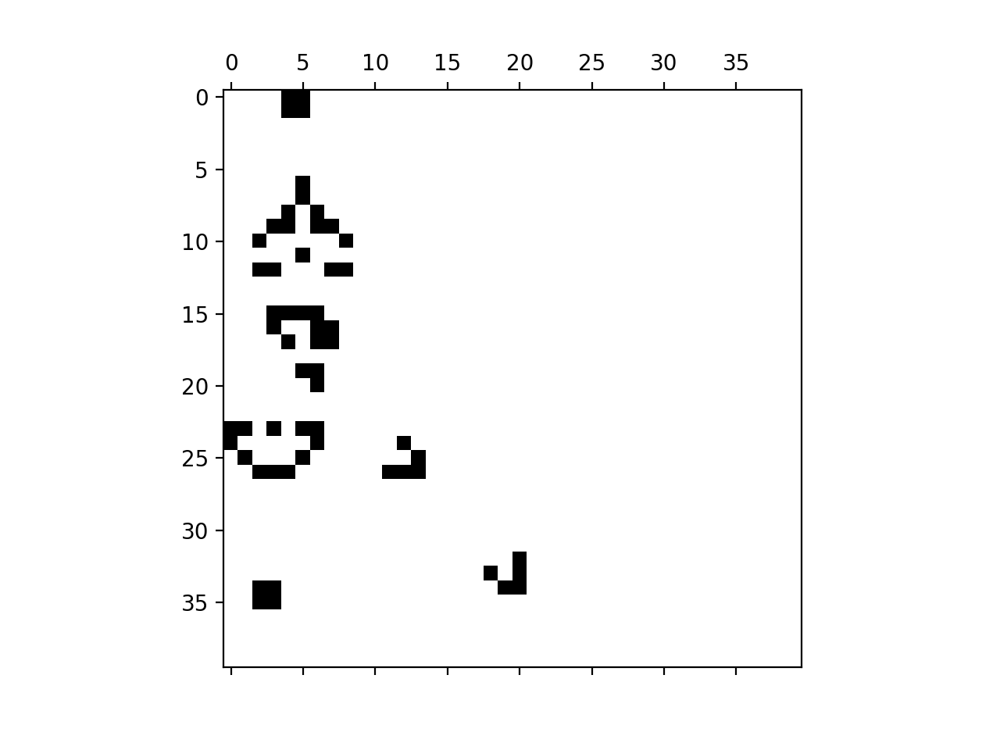

.. _style:

A matter of style
=================

.. dropdown:: Video: why style?

    .. container:: vimeo

        .. raw:: html

            <iframe src="https://player.vimeo.com/video/499766703"
            frameborder="0" allow="autoplay; fullscreen"
            allowfullscreen></iframe>

    Imperial students can also `watch this video on Panopto
    <https://imperial.cloud.panopto.eu/Panopto/Pages/Viewer.aspx?id=3572d8ea-5635-4b1a-9243-acae0150ddf8>`__

The value of convention
-----------------------

Consider the following definition of the limit of a function :math:`f` at a point :math:`c`:

.. proof:definition::

   Suppose we have a function :math:`f(x): \mathbb{R} \rightarrow \mathbb{R}`. Then:

   .. math::

      \lim_{x\rightarrow c} f(x) = L \iff \forall \delta > 0,\ \exists \epsilon > 0,\ |x - c| < \epsilon \Rightarrow |f(x) - L| < \delta

This is a perfectly valid definition of a limit: you could use it to
go on and derive all the analysis you have learned so far. However, you
would confuse yourself and your readers horribly, because I have
swapped the roles of :math:`\delta` and :math:`\epsilon` in the
definition. The formal properties of mathematical objects do not
depend on the names we give them or, often, on how we lay out formulae
on a page. However, mathematics is designed to be read by humans with
their habit-forming, pattern-matching brains. So if everyone adopts
similar conventions for how to write down mathematics, everyone
schooled in those conventions will find that mathematics easier to
understand. This is vitally important because understanding
mathematics is *hard*. Non-standard notation makes it doubly hard
because the reader has to consciously remember the meaning of all the
symbols. Conversely, once a reader has learned the notational
conventions for a field of mathematics, the meanings of the symbols
become natural and don't require conscious thought. This leaves all
the available brainpower to concentrate on the mathematical content
at hand.

You might at first think that this logic does not apply to computer
programs. After all, a computer program is read by another computer
program, and is not understood but rather acted on
mechanically. Surely it doesn't matter how it looks or what symbols
you use, so long as it's correct and, possibly, fast? This entirely
understandable sentiment has afflicted almost all programmers at some
point or another and typically has got them into more or less serious
difficulty before they realised that it's completely wrong.

In reality, a computer program is frequently read. Indeed, code is
typically read many more times than it is written or changed. Most
obviously, programmers read code in order to understand its functionality,
and in order to work out what is wrong with the code when it fails to
produce the correct results. Reading code is very much like reading
mathematics because a computer program is nothing but a realisation
of mathematical algorithms. Consequently, the observation that maths
can be very hard to read carries over to code, and therefore the need
to make code as easy to understand as possible also applies
here. Another analogy that carries over from mathematics is that very
often it's one's own work that one is trying to understand and
correct. This ought to create a very strong incentive to write very
clear code adhering to all the conventions, because the poor
individual who has to read your work to find the bugs might very well
be you!

Just as in mathematics, programming has a whole set of conventions
which sit on top of the formal requirements of a programming language.
These exist in order to make the code easier for all programmers
to read. Some of these rules, typically the more formulaic ones about
matters such as code layout and naming conventions, are somewhat
different in different programming languages. Others, most especially
higher lever principles like parsimony and modularity, are universal
principles that apply more or less regardless of the language employed
or the sort of programming being undertaken. Good programming style,
like good writing style, is a skill learned through experience and
through receiving feedback on the code you write, and it is not the
intention of this chapter to produce an exhaustive guide. However, it
is useful to introduce some of the key concepts, rules and conventions
in a more formal way.

PEP 8
-----

Publishers, journals, and institutions often have style guides
designed to instil a certain uniformity in the use of English (or
other human languages). Similarly, style guides exist for programming
languages. In some languages, the preferred style can vary
significantly from project to project, and there can be vigorous
disagreement between factions about fine points of style, such as
whether or not an opening curly bracket should start on a new
line. Fortunately, the Python community has an essentially unified and
very widely followed set of conventions. These are codified in one of
the Python standards documents, `PEP 8
<https://www.python.org/dev/peps/pep-0008/>`_ [#pep]_. PEP 8 isn't all
that long, and it is worth taking the time to read. Not every rule in
PEP 8 is reproduced in this chapter, though many of the most commonly
encountered ones are. Conversely, PEP 8 is rather narrowly concerned
with code layout rules while this chapter roams more widely.

Linters
.......

.. dropdown:: Video: installing and using a linter.

    .. container:: vimeo

        .. raw:: html

            <iframe src="https://player.vimeo.com/video/499770130"
            frameborder="0" allow="autoplay; fullscreen"
            allowfullscreen></iframe>

    Imperial students can also `watch this video on Panopto
    <https://imperial.cloud.panopto.eu/Panopto/Pages/Viewer.aspx?id=91c271e4-a61f-493c-a725-acae015273d5>`__

One of the helpful characteristics of PEP 8 is that many of its strictures can
be enforced automatically by a computer program. Programs that automatically
check programming style are called linters. Lint are the little fibres that tend
to stick to clothes, especially suit jackets, and make them ugly. So a linter is
a program that finds the little ugly things in your code.

Originally, you ran the linter with your source file as an input, and it produced
a report as an output, listing all of the problems it found in your code. You
can still run a linter like this, and it's very useful as an automated check
that the code committed to git is clean. However, Python-aware editors are often
able to run a linter for you, and display the results by highlighting code or
lines of code with problem. The effect is very like the highlighting of spelling
and grammar problems in many word processors and email clients.

One such program is called Flake8. Running Flake8 on all of the source
code in a project, preferably automatically on every commit, is an
excellent mechanism for keeping a project's code in PEP 8
conformance. Indeed, without a mechanism like this, there is a strong
tendency for programmers to cut style corners, with the effect that
the code in a project becomes harder and harder to read and work with.

Installing Flake8
.................

Flake8 is a Python package, which can be installed using pip. Make sure you've
activated your :term:`virtual environment` and then run:

.. code-block:: console

    $ python -m pip install flake8

This is enough to run Flake8 on the command line, however you will probably want
to set up your editor to highlight flake8 incompatibilities in your source. For
visual studio code, first open the command palette by typing :kbd:`control` +
:kbd:`shift` + :kbd:`P` (:kbd:`⌘` + :kbd:`shift` + :kbd:`P` on Mac). There type
"Python: Select Linter" to bring up the list of available linters, and select
"flake8" from the dropdown list. The video above shows this process.

How to tell Flake8 to shut up
.............................

Near the top of PEP 8 is the following heading:

.. 

    A foolish consistency is the hobgoblin of little minds.

What this refers to is that just religiously following PEP 8 is not enough to
produce highly readable code. Indeed, sometimes the rules might induce you do to
something which makes no sense at all. In those cases, one should step outside
PEP 8. This is a dangerous licence to take, and it is important to point out that
this does not mean that a programmer should ignore PEP 8 merely because they
disagree with a particular convention. Breaking PEP 8 is something you should do
only when you really have to.

In the rare cases where it is necessary to break PEP 8, Flake8 turns into a
problem. It doesn't know anything of the judgement call that the programmer has
made, and so will complain about the offending code. For example, we have
learned that it is frequently desirable to import names in the
:file:`__init__.py` file of a :term:`package` in order to include them in the
package's top level :term:`namespace`. The problem with this is that these names
are not used inside the :file:`__init__.py` file so Flake8 will complain that
this is an unnecessary import.

The way to suppress linter errors is using a special comment at the end of the
line which causes the error. For example, :file:`fibonacci/__init__.py` contains
the following line:

.. code-block:: python3

    from .fibonacci import fib

This causes the following Flake8 error:

.. code-block:: console

    $ flake8 fibonacci
    fibonacci/__init__.py:1:1: F401 '.fibonacci.fib' imported but unused

We suppress this error by adding this comment:

.. code-block:: python3

    from .fibonacci import fib  # noqa F401

The comment starts with the keyword `noqa`, which stands for "no questions
asked" and then gives the error code which is to be ignored for this line. This
can be found in the Flake8 output.

Code layout
-----------

Perhaps surprisingly, one of the most important factors in making code
readable is the space, or lack of it, between and around the text
which makes up the code. Whitespace affects readability in many
ways. Too much code bunched together makes it hard for the eye to
separate programme statements, while leaving too much space limits the
amount of code which fits in the editor window at once. This requires
the programmer to scroll constantly and to have to remember
definitions which are not currently on the screen.

As in written prose, whitespace can also convey information by
grouping together concepts which are related and separating distinct
ideas. This gives the reader visual clues which can aid in
understanding the code. With this in mind, we now turn to some of the
PEP 8 rules around white space and code formatting.

Blank lines
...........

1. Classes and functions defined at the top level of a module
   (i.e. not nested in other classes or functions) have two blank
   lines before and after them. These are the largest and most
   distinct units in a module, so it helps the reader to make them
   quite distinct from each other.
2. Methods within a class are separated by a single blank
   line. Similarly, functions defined inside other functions are
   separated from surrounding code by a single blank line.
3. Statements within functions usually follow on the immediate next
   line, except that logical groups of statements, can be separated by
   single blank lines. Think of each statement as a sentence following
   on from the previous, with blank lines used to divide the function
   into short paragraphs.

**Do not add extra blank lines to space out code**. Vertical space on
the screen is limited, your readers will not thank you.
   
White space within lines
........................

1. Don't put a space after an opening bracket (of any shape), or
   before a closing bracket. This is because the role of brackets is
   to group their contents, so it's confusing to visually separate the
   bracket from the contents.

    .. container:: badcode

        .. code-block:: python3

            ( 1, 2) # Space after opening bracket.
            (1, 2 ) # Space after closing bracket.

    .. container:: goodcode

        .. code-block:: python3
        
            (1, 2) # No space between brackets and contents.

2. Similarly, don't put a space between the function name and the
   opening round bracket of a function call, or between a variable
   name and the opening square bracket of an index. In each of these
   cases, the opening bracket belongs to the object, so it's confusing
   to insert space between the object name and the bracket.

    .. container:: badcode

        .. code-block:: python3

            my_function (1) # Space between function name and bracket.
            x [0] # Space between variable name and index square bracket.

    .. container:: goodcode

        .. code-block:: python3

            my_function(1)
            x[0]
 
3. Put a space after a comma but not before it, exactly like you would
   in writing prose. Following the convention that everyone is used to
   from writing aids understanding. Where a trailing comma comes right
   before a closing bracket, then don't put a space. The rule that
   there are no spaces before a closing bracket is more important.

     .. container:: badcode

        .. code-block:: python3

            (1,2,3) # Spaces missing after commas.
            (1 ,2 ,3) # Spurious spaces before commas.
            (1, ) # Space before closing bracket.

     .. container:: goodcode

        .. code-block:: python3

            (1, 2, 3) # Spaces after commas.
            (1,) # No space before closing bracket.

4. Put exactly one space on each side of an :ref:`assignment <assignment>` (`=`) and an
   :ref:`augmented assignment <augassign>` (`+=`, `-=`, etc.). In an assignment
   statement, the most important distinction is between the left and
   right hand sides of the assignment, so adding space here aids the
   reader.

    .. container:: badcode

        .. code-block:: python3

            x=1 # Missing spaces around equals sign.
            x+=1 # Missing spaces around augmented addition operator.

            frog = 2
            cat  = 3 # Additional space before equals sign.

    .. container:: goodcode

        .. code-block:: python3

            x = 1
            x += 1

            frog = 2
            cat = 3

5. Do not put a space either before or after the equals sign of a :ref:`keyword
   argument <tut-keywordargs>`. In this case, grouping the parameter name and
   the argument is more important. Also creates a visual distinction between
   assignment statements and keyword arguments.

    .. container:: badcode

        .. code-block:: python3

            myfunction(arg1 = val1, arg2 = val2) # Spaces around equals signs.

    .. container:: goodcode

        .. code-block:: python3

            myfunction(arg1=val1, arg2=val2)

6. Put exactly one space before and after the lowest priority
   mathematical operators in an expression. This has the effect of
   visually separating the terms of an expression, as we
   conventionally do in mathematics.

    .. container:: badcode

        .. code-block:: python3

            y = 3*x**2+4*x+5 # No spaces around +

    .. container:: goodcode

        .. code-block:: python3

            y = 3*x**2 + 4*x + 5

7. **Never, ever** have blank spaces at the end of a line, even a blank
   line. These tend to get changed by editors, which results in lots
   of spurious differences between otherwise identical code. This can
   make the difference between two commits of a file very hard to read
   indeed.

Line breaks
...........

1. Have no lines longer than 79 characters. Limiting the line length
   makes lines easier to read, and prevents the editor from
   automatically wrapping the line in harder to read ways. Shorter
   lines are also very useful when using side-by-side differencing
   tools to show the differences between two versions of a piece of
   code.
2. When breaking lines to fit under 79 characters, it's better to
   break the lines using the implied continuation within round, square
   or curly brackets than explicitly with a backslash. This is because
   the brackets provide good visual "book ends" for the beginning and
   end of the continuation.
3. When a mathematical operator occurs at a line break, always put the
   operator first on the next line, and not last on the first
   line. Having the second line start with a mathematical operator
   provides a solid visual clue that the next line is a continuation
   of the previous line. (If you look closely, this is also the rule
   that most publishers of maths books use).

    .. container:: badcode

        .. code-block:: python3

            my_function(first_term + # Trailing + operator.
                        second_term +
                        third_term)

    .. container:: goodcode

        .. code-block:: python3

            my_function(first_term
                        + second_term # Leading + operator
                        + third_term)

Indentation
...........

1. Indentation is *always* by four spaces per indentation level. Usually
   Python-aware text editors are good at enforcing this, and this is basically
   true of Visual Studio Code. If you're using a text editor which doesn't
   indent by four spaces (especially if it uses :kbd:`tab` characters for indentation)
   then Google how to change it to four spaces!
2. When indenting continuation lines inside brackets, there are two
   options, usually depending on how many characters are already on
   the line before the opening bracket:
   
   a. With one or more items on the first line after the opening
      bracket.  Subsequent lines are indented to one space more than
      the opening bracket, so that the first items on each line start
      exactly under each other. The closing bracket comes on the same
      line as the final item.

    .. container:: goodcode

        .. code-block:: python3

            capitals = {"France": "Paris",
                        "China": "Beijing", # First character one place right of {
                        "Australia": "Canberra"} # } at the end of the line.

   b. With the opening bracket as the last item on the first
      line. Subsequent lines are indented more than the first line but
      the same as each other. The closing bracket comes on a new line,
      and is either indented to the same level as the first line, or
      to the subsequent lines (but be consistent in nearby code about
      which).

    .. container:: goodcode

        .. code-block:: python3

            capitals = { # First line ends with {
                "Central African Republic": "Bangui", # Next line indented.
                "Trinidad and Tobago": "Port of Spain", # Indented to match.
                } # Indented to match.

Names
-----

Programs are full of names. Variables, classes, functions,
modules: much, perhaps most, of the text of a program is made up of
names. The choice of names, therefore, has a massive impact on the
readability of a program. There are two aspects to naming
conventions. One is a set of rules about the formatting of names: when
to use capitals, when underscores and so on. This is covered by PEP 8
and we reproduce some of the important rules below. The second aspect
is the choice of the letter, word, or words that make up a name. This
is much more a matter of judgement, though there are guiding principles
that greatly help with clarity.

PEP 8 name conventions
......................

PEP 8 has some rather detailed rules for naming, including for
advanced cases that we are unlikely to encounter in the short term,
but the most important rules are short and clear:

class names
    Class names use the CapWords convention: each word in a name is
    capitalised and words are concatenated, without underscores between.

    .. container:: badcode

        .. code-block:: python3

            my_class # No capitals, underscore between words.
            myClass # Missing leading capital.
            My_Class # Underscore between words.

    .. container:: goodcode

        .. code-block:: python3

            MyClass

exception names
    Exceptions are classes, so the rules for class names apply with the
    addition that exceptions that designate errors should end in
    `Error`.

    .. container:: goodcode

        .. code-block:: python3

            PolynomialDivisionError # For example to indicate indivisibility.

function, variable, and module names
    Almost all names other than classes are usually written in all
    lower case, with underscores separating words. Even proper nouns are
    usually spelt with lower case letters to avoid being confused with
    class names.

    .. container:: badcode

        .. code-block:: python3

            def Euler  # Don't capitalise function names.
            MaxRadius = 10.  # No CamelCase.

    .. container:: goodcode

        .. code-block:: python3
        
            def euler  # Lower case, even for names.
            max_radius = 10.  # Separate words with _.

method parameters
    The first parameter to an :term:`instance method` is the class
    itself. *Always and without exception* name this parameter `self`.

    .. container:: badcode

        .. code-block:: python3

            class MyClass:

                def __init__(instance, arg1, arg2):
                ...

    .. container:: goodcode

        .. code-block:: python3

            class MyClass:

                def __init__(self, arg1, arg2):
                ...

non-public methods and attributes
    If a method or attribute is not intended to be directly accessed
    from outside the class, it should have a name starting with an
    underscore. This provides a clear distinction between the public
    interface of a class and its internal implementation.

    .. container:: goodcode

        .. code-block:: python3

            class MyClass:

                def _internal_method(self, arg1):
                ...

Choosing names
..............

Short names help make short lines of code, which in turn makes it easier
to read and understand what the code does to the values it is
operating on. However short names can also be cryptic, making it
difficult to establish what the names mean. This creates a tension:
should names be short to create readable code, or long and descriptive
to clarify their meaning?

A good answer to this dilemma is that local variables should have
short names. These are often the most frequently occurring variables on
a line of code, which makes the statement more
intelligible. Should a reader be unclear what a variable stands for,
the definition of a local variable will not be very far
away. Conversely, a module, class, or function which might be used
far from its definition had better have a descriptive name which makes
its purpose immediately apparent.

Follow the mathematics
......................

Remember that the key objective of code style conventions is to make
it easier for readers to understand the code. If the code implements a
mathematical algorithm, then it's quite likely that readers of that
code will have at least a passing acquaintance with that area of
mathematics. You will therefore greatly help their intuition for what
your code does if the names in the code match the mathematical
conventions for the same concepts. You can use underscores to hint at
subscripts, just like in LaTeX. For example, if you write a function
which changes coordinates, then `x_old` and `x_new` are likely to be
good names for the coordinate vector before and after the
transformation.

As an exception to the rules about variable case, it is a good idea to
use single capital letter names in circumstances where they would be
used in the maths, for example, to name a matrix.

Mathematicians often use Greek letters as variable names,
occasionally they venture further afield and use Cyrillic or Hebrew
letters. Python does allow for variable names written in other
alphabets, but these are hard to type on many keyboards. Someone
trying to fix bugs in your code will curse you if they can't even type
the names! Do, by all means, use Greek or other language variable
names where this will make the relationship between the maths and the
code obvious, but write out the Greek letter name in Roman
letters. For example, `theta` is a very good name for a variable
representing an angle. Capital Greek letters are sometimes represented
by capitalising the first letter of the Roman word, but take care to
avoid situations where this might be confused for a class name.

Enforcing name conventions in Flake8
....................................

The core Flake8 package does not enforce the PEP 8 naming conventions, but there
is a plugin which does so. Simply install the :mod:`pep8-naming` package.

.. code-block:: console

    $ python -m pip install pep8-naming  

Parsimony
---------

Good programming style is primarily about making programmes easy to
understand. One of the key limitations of understanding is the sheer
number of objects that the reader can keep in their short term memory
at once. Without diverting into the psychology literature, this is
only a couple of handfuls of values at most. This means that the
largest amount of code that a reader can actively reason about is
limited to a few operations on a few variables. As a programmer, there
are two tools at your disposal to achieve this. The first is to be
parsimonious and not introduce unnecessary temporary variables. The
second is to use abstractions such as classes and function interfaces
to split the problem up into small pieces so that each individual
function or method is small enough for a reader to understand.

As a (somewhat contrived) example, assume that you need to create a list of all
the positive integers less than 9999 which are divisible by all the numbers up
to seven. You could write this in 5 difficult to understand lines:

.. container:: badcode

   .. code-block:: python3

         result = []

         for _ in range(1, 9999):
            if _ % 1 == 0 and _ % 2 == 0 and _ % 3 == 0 and _ % 4 == 0 \
                and _ % 5 == 0 and _ % 6 == 0 and _ % 7 == 0:
                    result.append(_)

It would be much better to write a single more abstract but simpler line:

.. container:: goodcode

    .. code-block:: python3

         result = [num for num in range(1, 9999) if all(num % x == 0 for x in range(1, 8))]

Use comprehensions
..................

It is very common to write loops to populate collection objects with
values. For example, we might make a list of the first 10 square
numbers for further use:

.. container:: badcode

    .. code-block:: python3

       squares = []
       for i in range(10):
           squares.append((i+1)**2)

This is a fairly typical, if simple, example. It takes three lines of
code: one to initialise the list, one to loop, and one to add the
values to the list. Alternatively, if we had used a :ref:`list
comprehension <tut-listcomps>`, all three steps would have been subsumed into a single
operation:

.. container:: goodcode

    .. code-block:: python3

       squares = [(i+1)**2 for i in range(10)]

At least for fairly simple operations, comprehensions are almost
always easier for the reader to understand than loops. In addition to
lists, comprehensions are also available for :ref:`sets <tut-sets>`
and :ref:`dictionaries <tut-dictionaries>`.

Redundant logical expressions
.............................

One exceptionally common failure of parsimony is to write expressions of the following form:

.. container:: badcode

   .. code-block:: python3

       if var == True:

To see the problem with this statement, let's write out its truth table:

.. rst-class:: center-align-center-col
      
   ===== =============
   `var` `var == True`
   ===== =============
   T     T
   F     F
   ===== =============

In other words, the expressions `var` and `var == True` are logically
equivalent (at least assuming `var` is a :ref:`boolean value <bltin-boolean-values>`), so it would
have been more parsimonious to write:

.. container:: goodcode

   .. code-block:: python3

      if var:

Similarly:

.. container:: badcode

   .. code-block:: python3

      if var == False:

is frowned upon by programmers in favour of:

.. container:: goodcode

   .. code-block:: python3

       if not var:

Finally, the use of :ref:`else <else>` (or :ref:`elif <elif>`) can reduce the number
of logical expressions that the reader has to read and
understand. This means that:

.. container:: badcode

    .. code-block:: python3

       if var:
           # Some code
       if not var:
           # Some other code

should be avoided in favour of:

.. container:: goodcode

    .. code-block:: python3

       if var:
           # Some code
       else:
           # Some other code.

In addition to having fewer logical operations which the reader needs
to understand, the `if...else` version explicitly ties
the two cases together as alternatives, which is an additional aid to
comprehension.

Use the fact that every object is True or False
...............................................

Every Python object is logically either :data:`True` or :data:`False` according to the
following rules:

1. :data:`None` is :data:`False`.

2. Zero is :data:`False`, all other numerical values are :data:`True`.

3. An empty collection is :data:`False`, any other container is :data:`True`. For
   example, an empty list is :data:`False`, but the list `[0, 0]` is :data:`True`.

4. The null string `""` is :data:`False`, a string containing any characters is :data:`True`.

5. A user-defined class is :data:`True` unless:

   a. It defines the :meth:`~object.__bool__` :term:`special
      method`. In this case the truth value is whatever this method
      returns.

   b. It doesn't define :meth:`~object.__bool__` but does define
      :meth:`~object.__len__`. In this case the object is :data:`False` if the
      length is zero, and :data:`True` otherwise.

These rules are laid out formally in :ref:`the Python documentation
<truth>`. One way that they can be used to write simpler, clearer code
is in the very common case of code that should only execute if a
collection object actually contains something. In that case, this form
of test is to be preferred:

.. container:: goodcode

    .. code-block:: python3

       if mysequence:
           # Some code using mysequence

instead of:

.. container:: badcode

    .. code-block:: python3

       if len(mysequence) > 0:
           # Some code using mysequence

.. _repetition:

Avoid repetitition
..................

Programmers very frequently need to do *nearly* the same thing over and over.
One obvious way to do this is to write code for the first case, then copy and
paste the code for subsequent cases, making changes as required. There are a
number of significant problems with this approach. First, it multiplies the
amount of code that a reader has to understand, and does so in a particularly
pernicious way. A reader will effectively have to play "spot the difference"
between the different code versions, and hope they don't miss something. Second,
it makes it incredibly easy for to get confused about which version of the code
a programmer is supposed to be working on. There are few things more frustrating
than attempting to fix a bug and repeatedly seeing that nothing changes, only to
discover hours (or days) later that you have been working on the wrong piece of
nearly-identical code. Finally, lets suppose that a bug is fixed - what happens
to the near-identical clones of that code? The chance is very high that the bug
stays unfixed in those versions thereby creating yet another spot the difference
puzzle for the next person encountering a bug.

Abstractions are essentially tools for removing harmful repetition. For example,
it may be possible to bundle up the repeated code in a function or class, and to
encode the differences between versions in the :term:`parameters <parameter>` to
the function or class constructor. If the differences between the versions of
the code require different code, as opposed to different values of some
quantities, then it may be possible to use :term:`inheritance` to avoid
repetition. We will return to this in :numref:`week %s<inheritance>`.

Comments
--------

Comments are non-code text included in programs to help explain what
they do. Since comments exist to aid understanding, some programmers
come to the conclusion that more comments imply more
understanding. Indeed, some programmers are even taught that every
line of code should have a comment. This could not be more wrong!

While judiciously deployed comments can be an essential aid to
understanding, too many comments can be worse than too few. If the
code is simple, elegant, and closely follows how a reader would expect
the algorithm to be written, then it will be readily understood
without comments. Conversely, attempting to rescue obscure, badly
thought-through code by writing about it is unlikely to remedy the
situation.

A further severe problem with comments is that they can easily become
out of date. If a piece of code is modified, it is all too easy for the
programmer to neglect to update accompanying comments. The result is
comments which explain one thing, code which does something else, and
exceptionally baffled readers.

Three rules for commenting
..........................

1. If code is so simple, clear, and obvious that it can be easily
   understood without comments, don't comment.
2. If code is not easily understood without comments, the problem is
   probably the code. Refactor the code to be simpler and easier to
   understand.
3. If, and only if, you are convinced that it is strictly necessary to do
   something unobvious, then do so and include a comment.

Comment why, not what
.....................

Even where a comment is unavoidable, it should still usually be
obvious *what* it is that code does. It is far more likely to be
justifiable to include a comment about *why* a particular approach is
taken. For example, it might be worth commenting why an apparently
simpler alternative strategy is actually invalid.

PEP 8 rules for comments
........................

Comments start with a single :file:`#` followed by a single space. 
:term:`Inline comments <inline comment>` are separated from the code by at least two spaces.

.. container:: badcode

    .. code-block:: python3

        self.count += 1# No space between code and comment.

        self.count += 1  #No space between # and comment text.

.. container:: goodcode

    .. code-block:: python3

        self.count += 1  # Two spaces before #, one after.

Each line of a block comment starts with a single :file:`#` indented to the same level as a
normal line of code. The :file:`#` is followed by a single space, unless a
particular piece of comment should be indented with respect to the paragraph it
is in, in which case additional spaces are allowed.

.. container:: goodcode

    .. code-block:: python3

        if somecondition(data):
            # Comment indented to the same level as the contents of the if
            # block.

Docstrings
----------

There is one enormous exception to the rule that comments should be
used only sparingly: docstrings. Docstrings (a portmanteau of
"documentation strings") are comments at the start of modules,
classes, and functions which describe public interfaces. The entire
point of a public interface is that the programmer using it should not
have to concern themselves with how it is implemented. They should,
therefore, not need to read the code in order to understand how to use
it. 

The :term:`Python interpreter` has special support for docstrings. When a user
calls :func:`help` on an :term:`object` (including a function or :term:`method`)
then any docstring on that object is used as the body of the resulting help
message. Docstrings are also understood by the Python documentation generation
system, `Sphinx <https://www.sphinx-doc.org/en/master/>`__. This enables
documentation webpages to be automatically generated from Python code. The
Python documentation in this course is generated by this system. For example,
recall that we met the function :func:`~fibonacci.fibonacci.fib`, which
calculates Fibonacci numbers, in :numref:`modules`. We can ask
:func:`~fibonacci.fibonacci.fib` for its documentation:

.. code-block:: ipython3

    In [1]: import fibonacci
    In [2]: help(fibonacci.fib)

The following is displayed:

    Help on function fib in module fibonacci.fibonacci:

    fib(n)
        Return the n-th Fibonacci number.

There is also a specific IPython help extension, which also works in Jupyter
notebooks (IPython and Jupyter are related projects). Appending a question mark
:kbd:`?` to an object name prints a slightly different version of the help information:

.. code-block:: ipython3

    In [3]: fibonacci.fib?
    Signature: fibonacci.fib(n)
    Docstring: Return the n-th Fibonacci number.
    File:      ~/docs/principles_of_programming/object-oriented-programming/fibonacci/fibonacci.py
    Type:      function

Finally, the same information is used in the :func:`web documentation
<fibonacci.fibonacci.fib>`. Notice that the :term:`function signature` is not a
part of the docstring. Python is capable of extracting the signature of the
function and adding it into the documentation without the programmer having to
manually add it to the docstring.

Where to use docstrings
.......................

Every public module, class, function, and method should have a docstring.
"Public" in this context means any code which is intended to be accessed from
outside the :ref:`module <modules>` in which it is defined.

Docstring conventions
.....................

Python itself doesn't know anything about docstring contents, it will simply
display the docstring when you ask for help. However, other tools such as those
that generate websites from documentation depend on you following the
conventions.

By convention, docstrings are delimited by three double quote characters (`"""`). 

Short docstrings
................

Simple functions which take one or two arguments can be documented with a single
line docstring which simply says what the function does. The Fibonacci example above
is a typical case. The single line should be an imperative sentence and end with
a full stop.

.. container:: badcode

    .. code-block:: python3

        def fib(n):
            "Return the n-th Fibonacci number" # Single quotes, missing full stop.

        def fib(n):
            """Returns the n-th Fibonacci number.""" # Sentence not imperative.

        def fib(n):
            """fib(n)
            Return the n-th Fibonacci number.""" # Don't include the function signature.

.. container:: goodcode

    .. code-block:: python3

        def fib(n):
            """Return the n-th Fibonacci number."""

Long docstrings
...............

Conversely, a more complex object will require much more information in its
docstring. Consider :func:`numpy.array` (click on the link for the
documentation). The web documentation, also generated from the docstring, needs
to cover 5 parameters, and detail the return type. It also contains several
examples, references to other functions, and an explanatory note. This is an
example of very good documentation.

There is no widely used official standard for the layout of a long docstring,
but there are two project or institution-based conventions that are recognised
by the web documentation system. One from `Google
<https://google.github.io/styleguide/pyguide.html#38-comments-and-docstrings>`__
and the other from the `Numpy
<https://numpydoc.readthedocs.io/en/latest/format.html>`__ project. You should
consistently use one of these styles across a whole project. Clearly if you are
contributing code to an existing project then you should follow their style.

Enforcing docstring conventions in Flake8
.........................................

The core Flake8 package does not enforce docstring conventions, but there is an
additional package :mod:`flake8-docstrings` which will do this for you. This is
installed using:

.. code-block:: console

    $ python -m pip install flake8-docstrings

Because there is more than one convention for long docstrings, this package
needs a little bit of configuration. You can select the docstring convention on
the command line:

.. code-block:: console

    $ flake8 --docstring-convention numpy

or by saving the configuration option in a config file. For example you can add
a file :file:`setup.cfg` alongside :file:`setup.py` at the top of your git
repository, and include the following:

.. code-block:: python3

    [flake8]
    docstring-convention=numpy

Alternative specifications for docstring conventions that are supported are
`google` and `pep257`.

A brief diversion into cellular automata
----------------------------------------

We'll now take a brief diversion into a completely different area of
mathematics: cellular automata. This is entirely irrelevant to the contents of
this course, except that it provides a useful and, hopefully, interesting basis
for this week's exercises. `The game of life
<https://en.wikipedia.org/wiki/Conway%27s_Game_of_Life>`__ is a mathematical
system invented by the mathematician `John Horton Conway FRS
<https://en.wikipedia.org/wiki/John_Horton_Conway>`__ in 1970. The board of the
game is a grid of squares, like an infinite piece of graph paper (though we'll
only work with finite boards, since our computers have finite memory). Each cell
on the board is either alive (value 1) or dead (value 0). The only human
interaction is to set the initial state of every square on the board to either
alive or dead. The game then proceeds as a series of steps. At each step the new
state of the board is calculated according to these rules:

0. The neighbours of a square are the 8 immediately surrounding squares.
1. Any square with exactly 3 live neighbours at the old step is live at the new
   step.
2. Any square which is alive at the old step and has exactly 2 live neighbours
   at the old step remains alive at the new step.
3. All other squares on the board at the new step are dead.

Using only these three rules, an amazingly complex array of behaviour can be
generated, depending only on the pattern of cells which starts off alive.
For example there are patterns of cells which are fixed, called "rocks",
"gliders" that fly across the board and "oscillators" which repeatedly switch
between a few states. It's simultaneously a fun toy and an important piece of
mathematics. For example, it's possible to prove that any algorithm that can be
executed on any computer can be represented by a suitable pattern of game of
life cells, and running the game will execute the algorithm.

    Snapshot of the Game of Life at one step. The black squares are live and the
    white ones are dead. Two gliders can be seen moving across the board at (25,
    12) and (33, 19).
 
Glossary
--------

 .. glossary::
    :sorted:

    block comment
        A comment which is the only text on one or more lines of code. Block
        comments are typically used to describe the code that follows them.

    docstring
        A literal :class:`string <str>` included at the start of a module, class or
        function which documents that code object.

    function signature
        The signature of a function is the name of the function and the
        arguments that it takes. The function signature is the basic information
        needed in order to know how to call that function.

    inline comment
        A comment which follows active code on a line. Inline comments are used
        to make a very brief clarification of the code on that line.

    modularity
       The design principle that programs should be broken into small,
       easily understandable units, which communicate with each other
       through clearly specified interfaces.

    parsimony
       The design principle that unnecessary code, names, and objects
       should be avoided.

Exercises
---------

.. panels::
    :card: quiz shadow

    .. link-button:: https://bb.imperial.ac.uk/webapps/assessment/take/launchAssessment.jsp?course_id=_25965_1&content_id=_2070388_1&mode=cpview
        :text: This week's quiz
        :classes: stretched-link 

.. proof:exercise::

    Install flake8, pep8-naming, and flake8-docstrings.
    Configure your Python editor to use flake8.

The `skeleton code for this week's exercises on GitHub Classroom
<https://classroom.github.com/a/GCKdXtVA>`__ contains a package :mod:`life`
which implements Conway's Game of Life. Accept the assignment, and clone the
repository. Install the package in editable mode. This will also install some
additional packages that the :mod:`life` package depends on. This is achieved
using an additional argument to :func:`setuptools.setup`.

.. code-block:: python3
    :caption: `setup.py` for the :mod:`life` package. The `install_requires`
        parameter is used to install other packages that :mod:`life` needs.

    from setuptools import setup, find_packages
    setup(
        name="life",
        version="0.1",
        packages=find_packages(),
        install_requires=[
            "matplotlib",
            "scipy",
            "numpy"
        ]
    )

A couple of example scripts are provided which demonstrate the game of life.
This one shows a glider flying across the board:

.. code-block:: console

    $ python scripts/glider.py

Running the script will pop up a window showing the board. If Visual Studio Code
is in full screen mode then that pop-up might appear on a different screen. It's
therefore a good idea to unmaximise Visual Studio Code before running the
script.

This script shows a `glider gun
<https://en.wikipedia.org/wiki/Gun_(cellular_automaton)>`__, which generates a
neverending sequence of gliders:

.. code-block:: console

    $ python scripts/glider_gun.py

.. proof:exercise:: 

    The author of the :mod:`life` package had clearly never heard of PEP 8: the
    style of the code is awful. Fix the style in the package so that there are
    no Flake8 errors. Among other things, you will need to write docstrings for
    all of the methods. The configuration file in the skeleton code sets the
    convention to Numpy, but actually you should only need short docstrings in
    this case so this won't make a difference.

.. proof:exercise::

    .. figure:: images/glider.png
        :height: 10em
        :align: right

        An upright glider, live squares in black.

    A pattern such as a glider clearly maintains its behaviour if translated,
    reflected or rotated.

    1.  Add a class :class:`Pattern` to :mod:`life.life`. The :term:`constructor` should
        take in a :mod:`numpy` array containing a pattern of 1s and 0s, and
        assign it to the :term:`attribute` `grid`.
    2.  Add :class:`Pattern` to the :keyword:`import` statement in
        :mod:`life.__init__`. 

    .. figure:: images/glider_v.png
        :height: 10em
        :align: right

        Vertically flipped glider.

    3.  Add a :term:`method` :meth:`flip_vertical` which returns a new
        :class:`Pattern` whose rows are in reversed order, so that the pattern
        is upside down.

        .. hint::

            A slice of the form `::-1` returns that dimension of an array in
            reverse order.

    .. figure:: images/glider_h.png
        :height: 10em
        :align: right

        Horizontally flipped glider.

    4.  Add a :term:`method` :meth:`flip_horizontal` which returns a new
        :class:`Pattern` whose rows are in reversed order, so that the pattern
        is reversed left-right.

    .. figure:: images/glider_t.png
        :height: 10em
        :align: right

        Transposed glider.

    5.  Add a :term:`method` :meth:`flip_diag` which returns a new pattern which
        is the transpose of the original.
    6.  Add a :term:`method` :meth:`rotate` with a :term:`parameter` `n`.
        This should return a new :class:`Pattern` which is the original pattern
        rotated through `n` right angles anticlockwise.

        .. hint::

            A rotation is the composition of a transpose and a reflection.

    .. figure:: images/glider_r.png
        :height: 10em
        :align: center

        Gliders rotated by 1, 2, and 3 right angles anticlockwise.

.. proof:exercise::

    Add a method :meth:`insert` to the :class:`Game` class. This should take two
    parameters, a :class:`Pattern` and a pair of integers representing a square
    on the game board. The method should modify the game board so as to insert
    the pattern provided at a location centred on the location given by the pair
    of integers.

    .. figure:: images/glider_inserted.png
        :width: 60%
        :align: center

        A glider inserted at the location (2, 5) (highlighted in orange).

Once you have completed the exercises, the third script provided will work. This
sets up two gliders which collide and eventually turn into a pattern of six
oscillating blinkers:

.. code-block:: console

    $ python scripts/two_gliders.py

.. note:: 

    Use this example in the quiz:

    False if src_petsc4py_exists and args.honour_petsc_dir else True

.. rubric:: Footnotes

.. [#pep] PEP stands for "Python Enhancement Proposal". PEPs describe
          everything from code style to voting algorithms among Python
          developers. Their main purpose, as the name suggests, is to
          document proposals for changes to the Python language. As
          such, they are usually of little interest to most Python
          users. However the PEPs having to do with style have wider
          significance.
