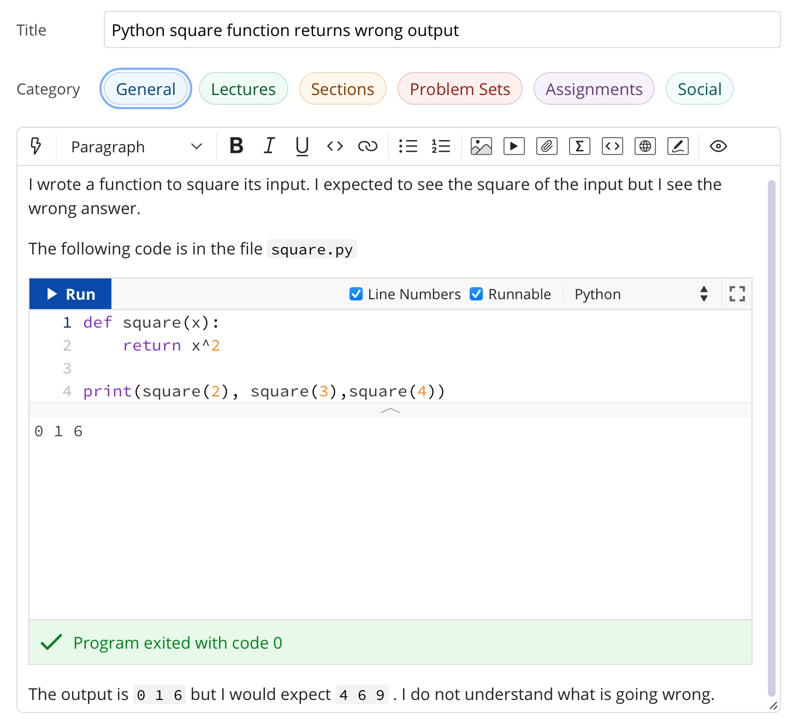

Getting help
------------

It is very likely that you will at some point find a programming problem you
can't solve, or will find what you believe to be a bug in a piece of software
you rely on. In these circumstances, you need to be able to ask for help, in
writing, in some sort of online forum. There is a skill to doing this, and
doing it well will help others to help you - which radically increases the
chance that you will quickly get a solution to your problem. Such a request for
help is called an issue report. It's sometimes also called a bug report, but
that's not always a very accurate description: when you experience trouble with
a piece of software then you have an issue, the issue may or may not be the
result of a bug in the software.

.. _issue-report:

Writing an issue report
.......................

The following sections explain the content that should (and sometimes shouldn't)
be in every issue report. You should get into the habit of thinking through all
of these stages every time you raise an issue. If the issue report is short then
there is no need to explicitly highlight each of these stages, so long as the
information is there. For a longer or more complex issue, it can make the issue
easier to read if you actually include these steps as subheadings.

Title 
.....

The title of the issue, which might go in the subject line of an email or a
forum post, should be a very short (10 word) outline of the key problem you
observe. Examples might include:

    Command not found when starting Python

    Inverting matrix results in FloatingPointError

    Incorrect values from MyClass.somemethod() for complex inputs

What these titles have in common is that they (very briefly) contain both what
the user was doing, and what went wrong. This is enough for someone reading the
title to have a picture of what sort of thing the user was doing, and what
seems to have gone wrong.

Notice that the titles do not need to be full sentences (there are no verbs in
any of them), but they are precise about what the user was doing, naming the
exact operation and error observed.

Steps to reproduce
..................

Next, it's very important to establish exactly what has happened. This is
essential both for the understanding of the people trying to help, and to
enable them to recreate the problem themselves. It doesn't need to be
particularly long, but it does need to be complete, in the sense that someone
else reading your description have enough information to know what you did and
(all else being equal), hit the same problem. The steps to reproduce can
themselves be divided into categories:

relevant system information
    The key word here is "relevant". For example if you're having trouble running
    Python itself, then which Python you installed on which operating system is
    very relevant. On the other hand if Python is running just fine but you're
    hitting an :term:`exception` that you don't understand, then it probably
    doesn't matter which operating system you are running.

which code failed
    Were you working on a particular exercise, which one? How would the helper
    find your code? If it's code that you have edited, then unless you have
    committed and pushed the changes, there is no way for a helper to get access
    to the code you actually ran, so they will be flying blind. Avoid attaching
    large amounts of code to issues, it's difficult for helpers to work with, or
    even to run in exactly the same way you did. It's much better to be able to
    point to a complete repository. Of course an even better approach is to construct a
    :ref:`minimal failing example <debugging-mfe>`.

what did you actually do?
    This is one point where running code from the terminal is a major advantage,
    because you can simply copy and paste everything you typed into the issue.
    Explaining precisely what you did with a graphical interface is much harder,
    and requires particular attention to detail. Remember that the person
    reading your issue report can't see what you can see, so if you skip over
    steps then they might not even be able to see the thing you say you clicked
    on!

It's important that the description of what you did is strictly a factual
historical record. This is not the time to speculate about what you think is
going wrong, we'll get to that bit. Here you're strictly repeating what you did.

.. note::

    Please avoid posting substantially complete solutions to programming
    exercises into a forum as this simply detracts from the learning experience
    of others. The best thing to do is to reduce your issue to a :term:`minimal
    failing example` and post that. If that's not possible and you're posting
    an issue as a part of a formal course with instructors, then ensure that
    you have pushed your work to Github (:numref:`commit_push`), and then post
    the git commit hash (:numref:`git-hash`). This will enable the instructor
    to find your code. It is still important to include all of the other
    components of the issue report.

Observed result
...............

The next stage is to describe what happened. Again, this is strictly a
reporting stage. You report your observations and only those. If there is
textual output, then include all of it. It's a very common failing for issue
reports to only contain the part of the output that the reporter thought was
relevant, omitting a whole load of essential information whose importance the
reporter did not realise.

If the problem is in the visual appearance of a graphical output, for example a
graph with invalid layout, then it would be appropriate to attach an image. 

Expected result
...............

This is the first point at which you are no longer simply a reporter of
observed facts. Sometimes the expected result is completely obvious: you
observed an error and you expected that the code would run correctly. However
in other circumstances there might not be an error but the result might not be
what you expect. Regardless of which of these is the case, you should include
some sort of statement of what you were expecting to have happen. This is for
two reasons, the first is that the mere fact of stating the question like this
forces you to think about what the core question you are asking is. This will
help you write a focussed issue report which is easier for your helpers to
respond to. The second is that a statement of what you think that the outcome
should be can help someone reading the issue report to understand the question
you are asking, and therefore that they should answer.

Any other information
.....................

Finally, you should add any other information you think is relevant. For
example if you think you have an idea about what is going on, then put it in
here. Alternatively if you've searched for the error online and think you've
found relevant information then include this here.

Issue pitfalls
..............

Many issue reports suffer from a few common failings. A lot of these come down
to not providing enough or precise enough information for those who might help
to actually do so. Always remember that the people you are asking for help
haven't seen what's on your screen, and don't know what have done. You
therefore need to spell things out for them in quite exacting detail.

Be precise
~~~~~~~~~~

Rather than just say that you got an error, state exactly which type or, if you
don't know, then repeat exactly what was printed out. Exactly which tool were
you using? Did a Python error occur in a particular script, or was it the
result of something you typed into the Python command line? 

Don't leap to conclusions
~~~~~~~~~~~~~~~~~~~~~~~~~

Very often you will have an idea about what has gone wrong. This is important
information, and you should include it in your issue report, however don't let
it distract you from providing a precise and complete description of what
happened. If you've not been able to fix the issue yourself, then you can't
exclude the possibility that you might not understand what it is that has gone
wrong. For this reason, you should always include everything you did and the
entirety of any error message, even if you don't think it's relevant to the
error.

Avoid "it"
~~~~~~~~~~

"It doesn't work" is every software developer's least favourite issue report.
When describing the programs and data that you are using, you have a mental
model of what you are working with. The reader of your issue does not share
this model, so when you use pronouns such as "it" then the reader frequently
has no idea what "it" is that you are referring to. If you know which program
failed, then name the program explicitly. If you don't then simply but
precisely describe what you observed.

Avoid screenshots of text
~~~~~~~~~~~~~~~~~~~~~~~~~

If the input and/or output of the operation which caused the issue are text,
then copy and paste that text into the issue. Do not insert a screenshot. There
are many reasons why screenshots are inferior to copying and pasting the text:

1. You don't know what screen the reader will be on. Screenshots can very
   easily end up very hard to read.
2. The reader can't search the text in a screenshot for particular words or
   phrases they need to find to diagnose your error.
3. The reader may well want to copy exactly what you typed in order to try to
   reproduce the error. They can't do that from a screenshot.
4. It is very easy for a screenshot to miss important information. For example
   many error messages are quite long, and part of the error may well have 
   scrolled out of view.

The only time when it is appropriate to include a screenshot is when the output
is graphical and you need to illustrate why something looks wrong.

.. Writing an issue report in Markdown
.. ...................................

.. Web fora are often optimised for making prose easy to read, so the forum will
.. do things like change indentation or the location of linebreaks in order to
.. make a nice paragraph of text in whichever area is available on the reader's
.. screen. This is great for prose, but absolutely disastrous for code or computer
.. output, because changing the linebreaks and other whitespace turns carefully
.. formatted information into scrambled junk. To overcome this, it is necessary to
.. tell the forum which parts of the text are prose, which are code, and possibly
.. other information (for example, you might want to add a mathematical formula). 

.. In order to support this, many web fora support some form of markup language. A
.. markup language represents the structure of the contents of a body of text by
.. inserting special instructions, called markup, into the text. You've already
.. learned one of these systems, because `LaTeX <https://www.latex-project.org>`__ is a markup system. The notes for
.. this course are written in `reStructuredText <https://docutils.readthedocs.io/en/sphinx-docs/user/rst/quickstart.html>`__,
.. which is another markup language. Many web fora, notably Piazza and GitHub, use
.. variants of another markup language called Markdown (computer scientists are
.. regrettably fond of poor puns when naming projects). Since we use Piazza in this
.. course we'll look at how to use a little Markdown to make your issue reports
.. much more readable. It's important to know that Markdown is not a standardised
.. language, so the exact functionality available depends somewhat on which forum
.. you are using Markdown for. For example GitHub doesn't support typesetting maths
.. from Markdown.

.. Including code, input, and output
.. ~~~~~~~~~~~~~~~~~~~~~~~~~~~~~~~~~

.. Code, commands you type at the terminal prompt, and output printed in the
.. terminal or in IPython are treated almost exactly the same way. The best
.. approach is to use what Markdown calls a "fenced code block". This means that
.. you put the code between "fences" comprising three backquotes on a
.. line by themselves. For example::

..     ```
..     $ cd myfolder
..     $ python myscript.py
..     ```

.. If the code in question is written in a language that the Markdown interpreter
.. knows about, and this is indicated at the end of the first fence, then the
.. syntax will be highlighted to make it easier to read::

..     ```python3
..     print("Hello World!")
..     ```

.. This results in something like:

.. .. code-block:: python3

..     print("Hello World!")

.. Similarly, you can mark the first fence with `ipython3` to indicate that the
.. code following is copied and pasted from an IPython command line. If you need to
.. include code inline in text, then you just contain it in single backquotes:
.. `\`some_code\``.

.. Including links
.. ~~~~~~~~~~~~~~~

.. Just dumping URLs into the text often results in hard to read code. Instead,
.. Markdown enables you to write the link text in square brackets followed by the
.. URL in round brackets. So::

..     [the Markdown Cheat Sheet](https://www.markdownguide.org/cheat-sheet/)

.. becomes `the Markdown Cheat Sheet <https://www.markdownguide.org/cheat-sheet/>`__.


.. More advanced Markdown
.. ~~~~~~~~~~~~~~~~~~~~~~

.. .. only:: not book

..     There are many other Markdown features that can be useful in longer posts,
..     and there are many resources about Markdown available online. `The Markdown
..     Guide <https://www.markdownguide.org>`__ is a good place to start.

.. .. only:: book

..     There are many other Markdown features that can be useful in longer posts,
..     and there are many resources about Markdown available online. The Markdown
..     Guide is a good place to start. [#markdown]_


.. An example issue report
.. .......................

.. A fairly short and simple issue report which includes all of the relevant
.. information, might be written in Markdown as follows. The title, which we omit
.. from the Markdown because it would be typed in a separate box on Piazza, might
.. be something like "Python square function returns wrong answer." 

.. .. code-block:: md

..     I wrote a function to square its input. I expected to see the
..     square of the input but I see the wrong answer.

..     The following code is in the file `square.py`:

..     ```python3
..     def square(x):
..         return x^2
..     ```

..     I try out this function in iPython and observe the wrong answers:

..     ```ipython3
..     In [1]: from square import square

..     In [2]: square(2)
..     Out[2]: 0

..     In [3]: square(3)
..     Out[3]: 1

..     In [4]: square(4)
..     Out[4]: 6
..     ```

..     I would expect to see 4, 9, 16 respectively. I do not understand what is
..     going wrong.

.. This results in the following, much more readable, post on Piazza:

.. .. image:: images/piazza_issue.png

An example issue report
.......................

This section shows a small example issue written on the forum system that
Imperial College London uses for its classes. The details of how to achieve the
right formatting will differ from forum to forum, but the principles are the
same. Importantly, most forum systems are optimised for making text easy to
read and will quite happily destroy the meaning of your code by moving the line
breaks to make the text fit the window. It's therefore important that code is
correctly formatted as code rather than as text. On this forum, this is
achieved using the :kbd:`<>` icons. The plain icon is for inline code while the
boxed version is for code blocks. In this particular forum software, a
self-contained :term:`minimal failing example` can be run directly in the
browser, providing additional information to helpers.




.. .. note::

..     The point of this example is to illustrate how to write an issue report.
..     However, you do actually know enough Python from your previous introductory
..     course to work out what's wrong with the code here. Can you see what the
..     problem is?

