.. _git:

Just enough Git to get by
=========================

The exercises in this book are all based on `Git <https://git-scm.com>`__
repositories hosted on `GitHub <https://github.com>`__. This is a deliberate
choice, because learning to use a revision control system such as Git is an
important part of learning to be a good programmer. If you're doing these
exercises as a part of a formal course, then GitHub classroom provides
additional support for automatically creating your personal repository for each
exercise, for submitting your work, and providing feedback through autotesting.
If you're working through this book yourself, you'll be able to use the
template repositories on GitHub to access everything you need to do the
exercises. 

.. only:: not book

    This introduction just provides enough information to enable you to set up
    and use Git, GitHub, and GitHub Classroom for the exercises in this book.
    For a more in-depth introduction to Git and GitHub, you are encouraged to
    work through the excellent `Git tutorial provided by the Software Carpentry
    project <http://swcarpentry.github.io/git-novice/>`__.

.. only:: book

    This introduction just provides enough information to enable you to set up
    and use Git, GitHub, and GitHub Classroom for the exercises in this book.
    For a more in-depth introduction to Git and GitHub, you are encouraged to
    work through the excellent Git tutorial provided by the Software Carpentry
    project. [#swcarpentry]_

What is Git?
------------

When we're writing code, we typically don't just type it out, notice that it
works, and stop. Instead, the usual cycle looks a bit more like this:

1. Write a small piece of code.
2. Use it to run some test problems to see if it works.
3. If there were problems, make a change and go back to step 2.
4. Once it's working, go back to step 1 and write the next small piece of code.

Each time we get to step 4, we're a little closer to having a working program
that does what we want. However, each time we go back through steps 1-3, we run
the risk that we don't just implement a new feature, but that in doing so we
break something we already had working. How do we make sure that we always know
exactly what the code used to look like when it worked? 

One answer is to keep saving old versions under different names. This is a bad
answer for two reasons. The first is that it swiftly descends into a confused
mess, as anyone who has ever been emailed a Word file named
`report_draft_final_revised2_johns_comments.doc` can attest! The second is that
the names of files and code objects often matter to programming languages - so
the mere action of saving your code under a different name can stop it working.

The right answer to the problems caused by constantly updating code (or any
other document) is a version control system. Sometimes these are also called
source control systems, or revision control systems. A version control system
is a piece of software which keeps track of versions of a collection of files
such as a software project. A well-used version control system can tell you:

1. What changed in the files.
2. When the change happened.
3. Who made the changes.

Version control systems also help with the edit conflicts that can occur
when more than one person edits a file, for example as a part of a group
project - or even when you edit the same file on two different computers.

Git is one such version control system, and it's one of the most capable and
widely used currently available.

What is GitHub?
---------------

Git keeps track of a collection of files stored in a project folder called a
repository which is kept on your computer. That's great but what if you want to
do any of the following?

1. Collaborate with someone else who also needs to edit the files.
2. Work on more than one computer.
3. Still have your repository if your computer is lost or your hard disk dies.

`GitHub <https://GitHub.com>`__ is a cloud service which stores copies of Git
repositories online. You can `push` your changes up to GitHub from any computer
with an internet connection and `pull` those changes down to any other computer.
GitHub also integrates with other software development tools such as automatic
testing frameworks, issue trackers and code review to provide a comprehensive
software development platform. Depending on the module you are taking, you may
also use some of these extra features of GitHub, but we will mostly focus on how
to use the core feature of storing a copy of your repository online.

What is GitHub Classroom?
-------------------------

All of the collaborative features of Git and GitHub might sound like overkill
when all you need to do is complete coding assignments that only you work on.
However in software development terms, you always have at least one
collaborator on your assignments: the module lecturer. Usually the lecturer
provides some initial skeleton code, such as some incomplete source files or
Jupyter notebooks. During the course of the work, you might need to show your
code to the lecturer or a teaching assistant in order to get help, and at the
end you need to share your work with the module staff to get it marked.

GitHub Classroom is a service that works with GitHub to provide every student
doing a particular coding exercise with their own repository on GitHub that's
prepopulated with the lecturer's skeleton code and ready to work with. As we'll
see below, this makes it really easy to obtain the exercise and work with it.

.. _configure_git:

Configuring Git
---------------

Git needs a little bit of configuration to work smoothly. This configuration
belongs to the computer you're running Git on, so you don't have to do this for
each project, but you do have to do it for each computer you log into. If
you use different machines that share your home folder on a network drive,
which is a common configuration in many workplaces and university computer
labs, then you'll only need to set up Git once for that whole cluster of
computers.

Before you start configuring Git, you'll want to make sure that you have a
working Git installation using the instructions on the book web page: 
`https://object-oriented-python.github.io/installation.html
<https://object-oriented-python.github.io/installation.html>`__

Your details
~~~~~~~~~~~~

First you need to tell Git about your name and email address. This has nothing
directly to do with the information you provided to GitHub, instead it will
just be used by Git to label you as the author of the code that you write. To
save on a great deal of confusion later, you should register the actual name
that you usually go by. The email address simply needs to be a working email
address which will reach you. :ref:`Open a terminal <terminal>` and run the
following commands, replacing your name as appropriate:

.. code-block:: console

    $ git config --global user.name "Jo Student"
    $ git config --global user.email "Jo.Student20@imperial.ac.uk"

Line endings
~~~~~~~~~~~~

When a text file, such as a program source file, contains a line break, this is
represented by a special invisible character. Unfortunately, it's not the same
character on different operating systems, which can make a bit of a mess when a
file is created on one operating system, and then edited on another - such as
might happen if your lecturer uses a different operating system for you. We can
set up Git to automatically clean up this mess in most cases.

Windows
.......

Run the following command in the :ref:`Git Bash terminal <terminal>`:

.. code-block:: console

    $ git config --global core.autocrlf true

MacOS or Linux
..............

Run the following command in the :ref:`terminal <terminal>`:

.. code-block:: console

    $ git config --global core.autocrlf input

Text editor
~~~~~~~~~~~

Git sometimes needs you to write a text comment. When this is the case, it will
launch a text editor to enable you to type the comment in. If you don't have
strong preferences for a particular editor, then `nano` is a good choice, so run
the following line in the terminal:

.. code-block:: console

    $ git config --global core.editor "nano -w"

If you have Visual Studio Code set up to run from the terminal, then this is
another good choice of Git editor. Run the following to check that you can run
Visual Studio Code from the terminal:

.. code-block:: console

    $ code -v
    1.62.0
    b3318bc0524af3d74034b8bb8a64df0ccf35549a
    x64

You will almost certainly see different version information, and this is fine.
Assuming that worked, run the following to set Visual Studio Code as your Git
editor:

.. code-block:: console

    git config --global core.editor "code --wait"

.. only:: not book

    If you have a different favourite text editor, you can set it using the
    `Software Carpentry instructions
    <https://swcarpentry.github.io/git-novice/02-setup/index.html>`_.
    
.. only:: book

    If you have a different favourite text editor, you can set it using the
    Software Carpentry instructions. [#swcarpentry_editor]_

Default pull behaviour
~~~~~~~~~~~~~~~~~~~~~~

Once we start using Git to interact with GitHub, there are some very technical
choices to be made about the precise behaviour of Git when two users have
edited the same repository. We needn't go into the details of this here, but we
do need to make a choice of this configuration, and the following one will do:

.. code-block:: console

    $ git config --global pull.rebase true

.. _github_signup:

Signing up to GitHub
--------------------

You will need your own GitHub account. This is completely
separate from any computer account you might have, so you need to sign up
separately. If you've already got a GitHub account then you don't need another
one. Assuming you don't already have an account, 
navigate to `https://github.com 
<https://github.com/>`_ and sign up for an account.

There are three fields to fill out:

Email Address
    You need to use a real email address that works and you have access to, as
    GitHub will send you a verification email which you need to respond to. If
    you are a student or staff member at an educational institution, it's a
    good idea to use your official email here, as this will make it easier to
    sign up for educational benefits from GitHub.

Password
    Choose a good, secure password. Do **not** use the same password as you use
    for your Imperial computer account.

Username
    You can use any name that is not already taken on GitHub. It doesn't need
    to have any relationship to any account name that you might have elsewhere,
    for example at a university.

.. container:: vimeo

    .. raw:: html

        <iframe src="https://player.vimeo.com/video/458177178" 
        frameborder="0" allow="autoplay; fullscreen"
        allowfullscreen></iframe>

Enabling two-factor authentication
~~~~~~~~~~~~~~~~~~~~~~~~~~~~~~~~~~

Your GitHub account will store code that you spent valuable time writing. You
will therefore really want to avoid losing that work through some nasty person
gaining unauthorised access to your GitHub account and exploiting it for their
nefarious purposes. For this reason, it is a really, really good idea to enable
two factor authentication on your GitHub account (and, indeed, all your other
online accounts). Navigate to `https://docs.github.com/en/authentication
<https://docs.github.com/en/authentication>`__ and select "Securing your
account with two-factor authentication (2FA)" to find out how to do this. 

Obtaining GitHub Education benefits
~~~~~~~~~~~~~~~~~~~~~~~~~~~~~~~~~~~

GitHub provide upgraded "pro" accounts and a bundle of other online tools for
free to students and staff of educational institutions. You don't strictly need
this in order to do the exercises in this book, but some of it
may be nice to have if you intend to do more software development. You can
register for these benefits at `https://education.github.com/benefits
<https://education.github.com/benefits>`__.

.. _github_classroom_exercise:

Doing exercises using GitHub or GitHub Classroom
------------------------------------------------

The exercises in this book are available as GitHub repositories, including
skeleton code and automated testing. The way that you use Git and GitHub to
access and do these exercises is always the same, though there are two
different ways of initially generating your personal exercise repository on
GitHub, depending on whether you are doing these exercises as a part of a
formal course which the instructor has set up using GitHub classroom, or you
are doing the exercises by yourself in private study. If you're using GitHub
classroom as a part of a formal course where the instructor will be using
GitHub classroom then follow the instructions in :numref:`accept_classroom`.
If you're working on the exercises by yourself then follow the instructions in
:numref:`accept_template`.

.. container:: vimeo

    .. raw:: html

        <iframe src="https://player.vimeo.com/video/458609356"
        frameborder="0" allow="autoplay; fullscreen"
        allowfullscreen></iframe>

.. _accept_classroom:

Accepting the assignment on GitHub Classroom
~~~~~~~~~~~~~~~~~~~~~~~~~~~~~~~~~~~~~~~~~~~~

For each exercise, your module will provide access to a link that you can use
to accept the corresponding GitHub classroom assignment. In this case, there is
a tiny toy assignment created just for this exercise. The assignment acceptance
link is available on the exercises page for this book:
`https://object-oriented-python.github.io/edition3/exercises.html
<https://object-oriented-python.github.io/edition3/exercises.html>`__

When you click on the assignment, if you're not already logged into your `GitHub
<https://GitHub.com>`__ account then you will be prompted to do so. If this is
your first GitHub Classroom assignment, you'll also be asked to give GitHub
Classroom permission to access your GitHub account. You should do so.

You will now be asked to accept the assignment. Do so by clicking on the large
green button. GitHub Classroom will now create a new repository containing your
personal copy of the assignment. You can click on the link provided to navigate
to your new GitHub repository. You will also receive an email inviting you to
this repository. You can now skip forward to :numref:`exercise_instructions`. 

.. _accept_template:

Accessing the exercise using the template repository
~~~~~~~~~~~~~~~~~~~~~~~~~~~~~~~~~~~~~~~~~~~~~~~~~~~~

If you don't have an instructor who has set up GitHub Classroom exercises for
your course then you will obtain your copy of the exercise by creating a new
repository in your GitHub account using the template provided. To use the
template, navigate to the exercise repository, which in this case is:
`https://github.com/oopython-exercises/hello
<https://github.com/oopython-exercises/hello>`__. On that page, click on the
green button :kbd:`Use this template`. This will take you to a page which will
ask you to choose a name for your new repository. It would be reasonable to use
the same name as the template. In this case, :kbd:`hello`. Click on the green
button marked :kbd:`Create repository from template`. 

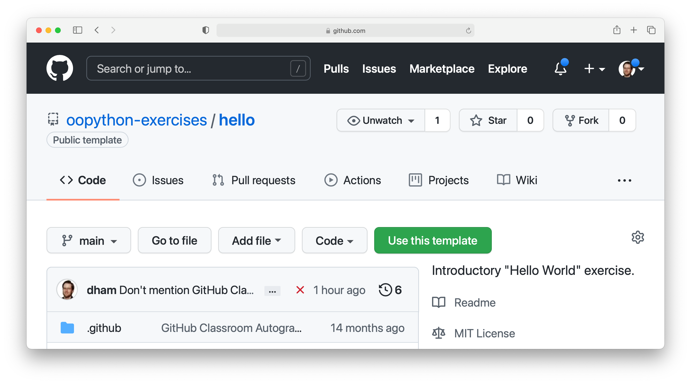

.. only:: book

    .. raw:: latex

        \clearpage

.. _exercise_instructions:

The exercise instructions
~~~~~~~~~~~~~~~~~~~~~~~~~

Whichever way we accessed the exercise, we now have an exercise repository. If
we scroll down on the front page of the GitHub repository website, we see the
README file for this repository. In this case, this gives us the instructions
for the assignment. For most of the exercises in this course, the instructions
will be in this book at the end of the relevant chapter. This time, we see
this:

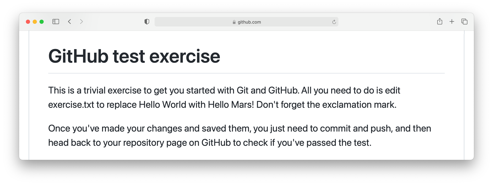

So what we have to do is:

    1. Edit `exercise.txt` to replace "Hello World" with "Hello Mars!"
    2. Commit this change.
    3. Push the result to GitHub.

We'll go through each of these steps and what they mean below. First, though,
we'll need to clone the repository to our computer.

Cloning the repository
~~~~~~~~~~~~~~~~~~~~~~

Your new repository currently exists only on `GitHub <https://github.com>`__, but
you need a local copy on your machine (or on a remote machine that you're logged
into) in order to work on it. This is called cloning the repository. Here
we show how to do this using commands in the terminal, because this approach is 
the most likely to be available on all systems.
Start by :ref:`opening a terminal <terminal>`. 

Next, you will need the URL of your GitHub repository. On the repository
webpage, click on the large green `Code` button on the right:

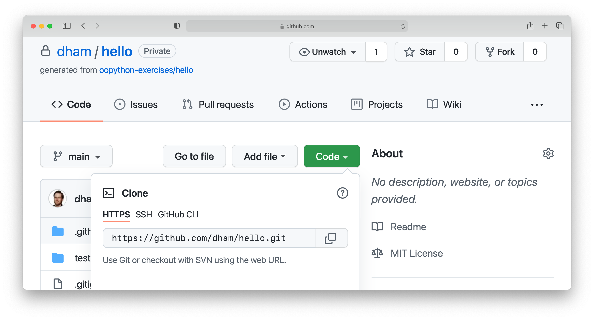

Click on the little picture of a clipboard to copy the URL. Now, back in your
terminal type (without pressing :kbd:`enter`):

.. code-block:: console

    $ git clone

Paste the URL you copied into the terminal after `clone` and then press :kbd:`enter`.
If you are asked for your GitHub username and password, enter them, and the
repository will download. The process should look a little like this:

.. code-block:: console

   $ git clone https://github.com/dham/hello.git
   Cloning into 'hello'...
   info: please complete authentication in your browser...
   remote: Enumerating objects: 13, done.
   remote: Counting objects: 100% (13/13), done.
   remote: Compressing objects: 100% (9/9), done.
   remote: Total 13 (delta 0), reused 11 (delta 0), pack-reused 0
   Receiving objects: 100% (13/13), done.
   $ 
        
This will create a new folder in the current folder containing the repository.
The folder will have the same name as the repository on GitHub, so in this case
it's called `hello`. The command to change the current
folder is `cd` (for "change directory") so we now change into our repository:

.. code-block:: console

    $ cd hello

We can now check that we're in the folder we think we're in by running the
command `pwd` ("print working directory"):

.. code-block:: console

    $ pwd
    $ /Users/dham/hello

This shows me that we're in the `hello` folder in my user
folder (`/Users/dham`), which is what I expect.

.. note::

    There are several other ways of cloning a GitHub repository, including over
    ssh or using specialist graphical or command-line Git clients. Any of these
    approaches is equally valid to the one shown here. The only approach which
    will not work properly is to download the zip file of the repository. This
    will download all the files and folders, but none of the data Git needs for
    revision control.

    The instructions here focus on command line interfaces because it's a lot
    easier to ask for help if you get stuck with a command line interface. "I
    typed the following and this was the resulting output" is a much easier and
    more precise way of describing a problem than attempting to explain what
    you did in a graphical interface.

Editing `exercise.txt`
~~~~~~~~~~~~~~~~~~~~~~

I can now check out what's in
this folder with the `ls` command (for "list"):

.. code-block:: console

    $ ls 
    LICENSE		README.rst	exercise.txt	tests

There are four files or folders here, one of which is `exercise.txt`, which is
the one I need to edit. I could use any text editor for this purpose, for
example if I have Visual Studio Code installed then this would be a very
suitable editor. However here we'll only assume that you've installed `Git` so
we'll use the very basic editor `nano`, which is almost certainly installed:

.. code-block:: console

    $ nano exercise.txt

This will open the nano editor in your terminal. You should see something like
the following:

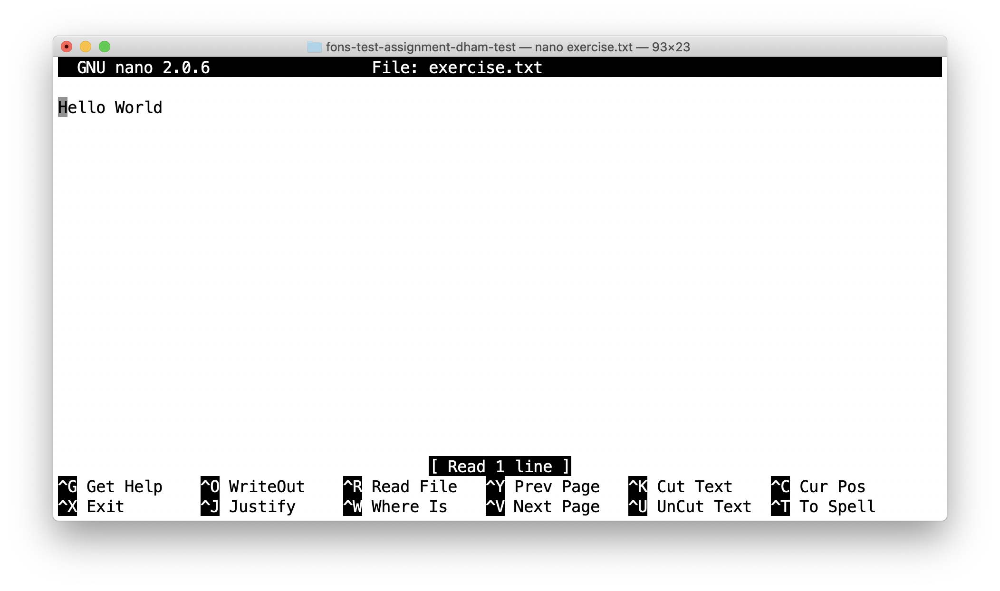

Now you can use the arrow keys and keyboard to delete "World" and replace it
with "Mars!" (remember the exclamation mark!) Don't try to move to the end of
the line by clicking with the mouse, that won't work (nano is far too basic for
that!)

Once you've edited the line, you need to save the file and quit nano. Helpfully,
nano shows a lot of its options along the bottom of the screen. We just need to
know that the caret symbol (`^`) stands for the `control` key. So we press
:kbd:`control` + :kbd:`O` to write out (save) our changes (Note for Mac users, this really
does mean the :kbd:`control` key, and not :kbd:`⌘`). Nano will offer us the option of
changing the filename, but we don't want to do that so we just press :kbd:`enter` to
save to the same file:

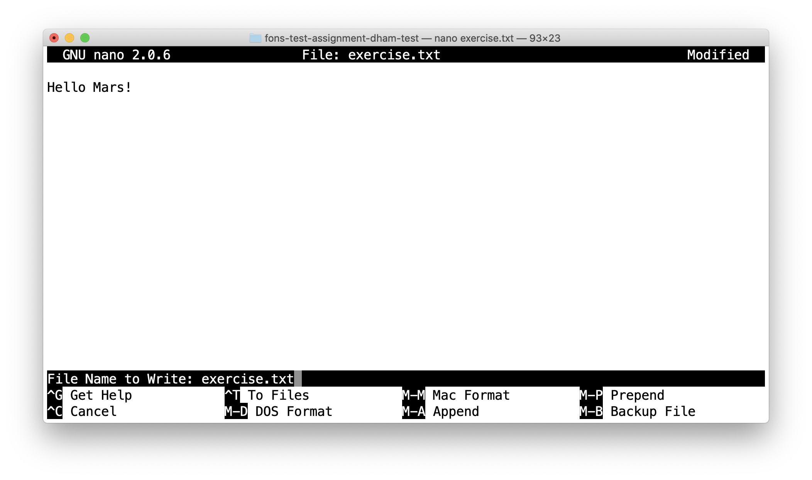

Next we quit nano by typing :kbd:`control` + :kbd:`X`.

.. _commit_push:

Committing our changes
~~~~~~~~~~~~~~~~~~~~~~

Now that we've changed `exercise.txt`, we need to tell Git to record this
change. Each change (to one or many files) that we tell Git about is called a
"commit" and the process is called "committing". First, we take a look at what
Git can currently see about our repository. The command for this, indeed the go
to command whenever you're not quite sure what's going on in your Git
repository, is:

.. code-block:: console

   $ git status
   On branch main
   Your branch is up to date with 'origin/main'.

   Changes not staged for commit:
     (use "git add <file>..." to update what will be committed)
     (use "git restore <file>..." to discard changes in working directory)
           modified:   exercise.txt

   no changes added to commit (use "git add" and/or "git commit -a")

Let's pull this apart line by line. The first line says that we're on the
`main` branch. Branches are a somewhat more advanced feature, but here we only
need to understand that `main` is the default name for the main place to store
commits in a Git repository. 

To understand the second line, we need to know that Git, by default, calls our
repository on GitHub `origin`. So the second line means that, as far as Git can
see, every commit that exists on our machine is also on GitHub, and vice versa.

Next comes a blank line, we'll come back to what might appear there shortly.
The next line says "Changes not staged for commit". This means that Git can see
that these files have changed or have been added, but Git has not been told
that they should be committed. Git is also very helpful in telling us what we
probably want to do next, so we are informed that we can tell Git that we
intend to commit a file using `git add`, or we can undo the changes in a file
back to the last committed version using `git restore`. Finally, Git tells us
that right now there are no changes added to commit, so we either need to use
`git add` or the shortcut version `git commit -a`. We'll come back to the
second of those presently, but first let's learn about `git add`.

.. note::

    The default branch may be called something other than `main`. In
    particular, older repositories often have a default branch called `master`.
    It doesn't matter what the default branch is called.

Staging files for commit
........................

We want to commit our changes to `exercise.txt`, so we tell Git to add it to the
list of files to be committed:

.. code-block:: console

    git add exercise.txt

We can check what that did by running `git status`:

.. code-block:: console

   $ git status
   On branch main
   Your branch is up to date with 'origin/main'.

   Changes to be committed:
     (use "git restore --staged <file>..." to unstage)
           modified:   exercise.txt

The first two lines of the output are unchanged, but now we see that
`exercise.txt` appears on the list of changes to be committed. We say that the
changes are "staged" for commit. Git once again helpfully tells us that if we
didn't mean to do that then we should use the command `git restore --staged` to
unstage the file. However, we did mean to stage `exercise.txt` so now we can go
on to make the actual commit.

.. .. only:: book

..     .. raw:: latex

..         \clearpage

.. warning::

    Some sites on the internet advocate the following version of `git add`:

    .. container:: badcode

        .. code-block:: console

            $ git add -A

    This is a **very bad** idea. What this command does is stage for commit
    every file in the repository that is not exactly the same as the already
    committed version. This can include any number of automatically generated
    binary files that you have generated or that your computer uses to manage
    the file system. Committing these files makes a complete mess of your
    repository and can cause conflicts if you try to clone your repository on
    another machine. Don't use `git add -A`!

The actual commit
.................

Having staged the file(s) for commit, we need to actually make the commit. We do
this with the following command:

.. code-block:: console

    $ git commit -m "Changed World to Mars"
    [main 316a22c] Changed World to Mars
     1 file changed, 1 insertion(+), 1 deletion(-)

`git commit` tells Git to commit all staged files. Git always needs a message
describing what has changed. I've provided this by passing the `-m` option
followed by the commit message in quotation marks. If I were to leave off the
`-m` option and commit message, then Git would open the text editor I configured
earlier (nano) for me to enter the commit message. I would save the commit
message and quit the editor, after which the commit would go ahead as above.

Let's use our go to command, `git status` to see what we've done:

.. code-block:: console

    $ git status
    On branch main
    Your branch is ahead of 'origin/main' by 1 commit.
      (use "git push" to publish your local commits)

    nothing to commit, working tree clean

This is now quite different from what we've seen before. We're still on branch
main, but now we're informed that we're ahead of `origin/main` by one
commit. This is because we've made a commit locally on our machine, but we
haven't yet pushed that change up to GitHub. Git helpfully informs us that we
could remedy this situation using `git push`. Because we've committed all the
changes we made, we're also informed that there is nothing more to commit.

Before we proceed to pushing our changes to GitHub, we'll take a look at a
quicker way to stage and commit changes in a single command.

Stage and commit in a single command
....................................

Most of the time, you will make changes to one or more files that Git already
knows about. In these circumstances, there's a shortcut command, and it's one
that Git already hinted to us about. Instead of separately running `git add`
followed by `git commit`, we can use `git commit -a`. We still need to provide
a commit message, so the equivalent to the two commands above would be:

.. code-block:: console

    $ git commit -am "Changed World to Mars"
    [main 316a22c] Changed World to Mars
     1 file changed, 1 insertion(+), 1 deletion(-)

Now if we type `git status`, we discover we are in exactly the same state as
when we type the two commands separately:

.. code-block:: console

    $ git status
    On branch main
    Your branch is ahead of 'origin/main' by 1 commit.
      (use "git push" to publish your local commits)

    nothing to commit, working tree clean

Pushing changes to GitHub
.........................

The final stage in the commit process is to push the changes we have made up to
GitHub:

.. code-block:: console

   $ git push
   Enumerating objects: 5, done.
   Counting objects: 100% (5/5), done.
   Delta compression using up to 8 threads
   Compressing objects: 100% (2/2), done.
   Writing objects: 100% (3/3), 284 bytes | 284.00 KiB/s, done.
   Total 3 (delta 1), reused 0 (delta 0), pack-reused 0
   remote: Resolving deltas: 100% (1/1), completed with 1 local object.
   To https://github.com/dham/hello.git
      fdc1dec..316a22c  main -> main

Depending on your configuration, you might have to enter your GitHub username
and password. The output includes quite a lot of detail that we currently don't
care about, but the last two lines tell us which GitHub repository we were
pushing to, and that we pushed the local main branch to the GitHub main
branch.

If we now type `git status`, we find that we are no longer ahead of
`origin/main`:

.. code-block:: console

   $ git status
   On branch main
   Your branch is up to date with 'origin/main'.

   nothing to commit, working tree clean

If we turn back to the repository website on GitHub, we can also see that the
commit has arrived:

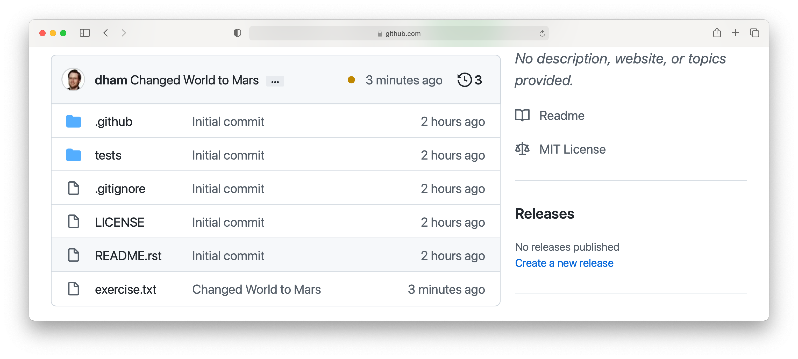

Notice that we can see the commit message both in the bar at the top of the
file list, and next to the file that we changed. By clicking on the little
clock icon at the right hand side of the top bar, we can see a list of all the
changes that have ever happened on the main branch of our repository:

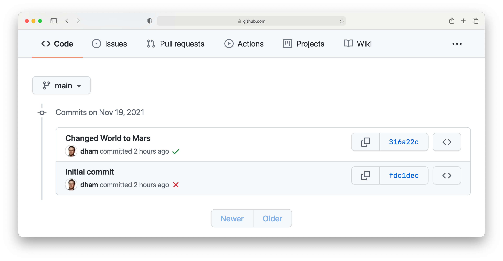

Clicking on the title of any of these commits, produces a colour-coded
rendition of the exact changes that occurred at that commit. For example, if we
click on the title of the commit that we just made, then we find:

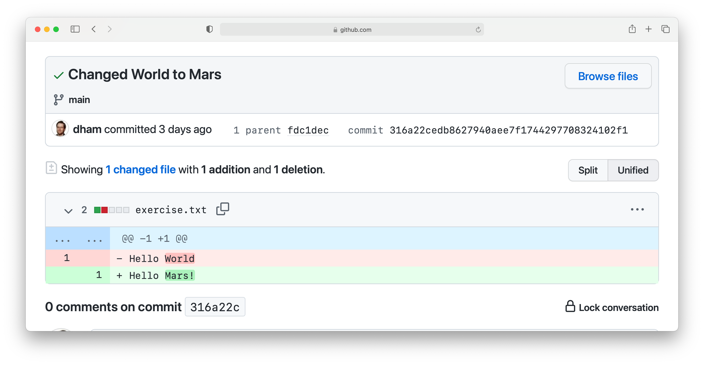

.. _git-hash:

Reporting the commit hash
~~~~~~~~~~~~~~~~~~~~~~~~~

Sometimes you might need to identify a particular commit, for example to submit
a piece of coursework, or to identify the particular code about which you are
asking for help. Git associates a unique string of characters with each commit.
This is known as the commit hash, because it's a cryptographic hash value of the
files in the commit. However it's not important how the commit hash is computed,
all that one needs to know is that the hash value is sufficient for someone else
who has access to your repository to find the exact commit that you mean. 

It is possible to find the hash of a commit locally, in the copy of the
repository on your computer. However this is a dangerous practice, because you
might not have pushed that commit to GitHub, so you risk sending someone on a
wild goose chase for a commit that they will never find. It is therefore a much
better idea to grab the commit hash for the commit you want directly from the
GitHub web interface. The most reliable way to find the commit hash is to follow
the steps above to navigate to the commit in which you are interested. The
commit has his the 40 character hexadecimal number on the right: in this case
`316a22cedb8627940aee7f1744297708324102f1`.

Autograding with GitHub Actions
~~~~~~~~~~~~~~~~~~~~~~~~~~~~~~~

Notice in the commit list above that the final (top) commit has a green tick
mark next to it, while the previous commit has a red cross. These marks appear
because GitHub has been configured to automatically run tests on each commit to
provide immediate feedback as to the correctness of the work. Autograding is
the generic term for this sort of automated testing when applied to coursework.
It doesn't necessarily imply that you will receive marks for passing the tests.
If we click on the green tick and then on `details`, we can see a little more
information:

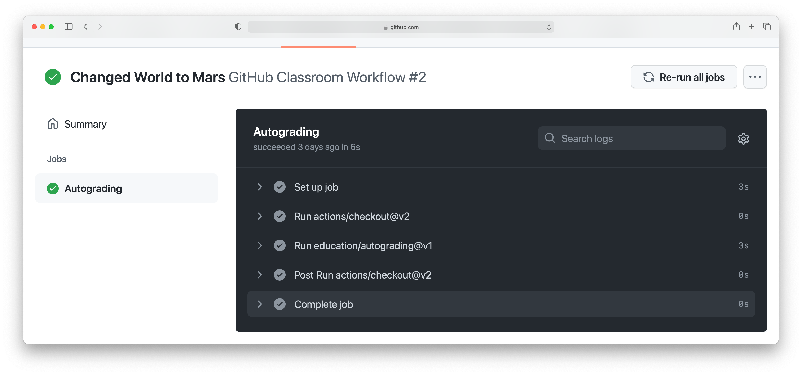

This case isn't all that interesting, because we're passing everything.
It's actually more interesting to go back and click on the red cross:

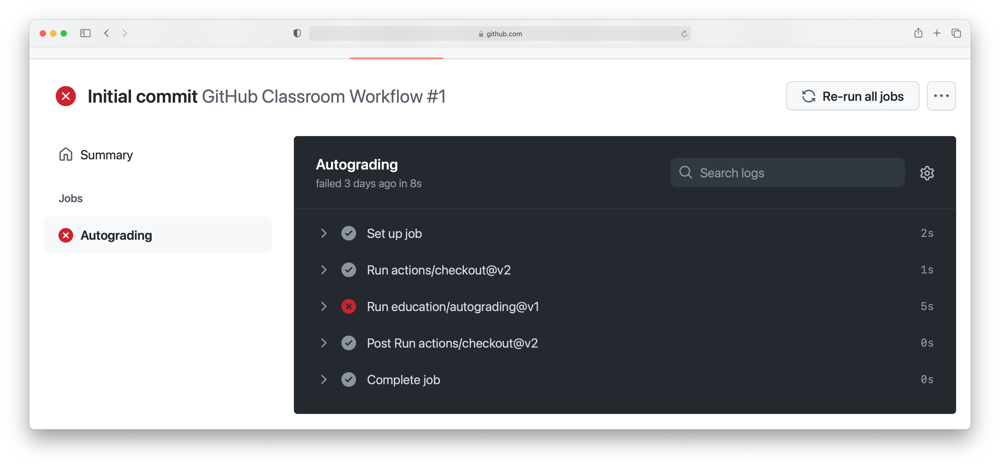

By expanding the line with the red cross and scrolling down, we can see the
details of the test that has failed. Hopefully this will give us some indication
as to what we have done wrong:

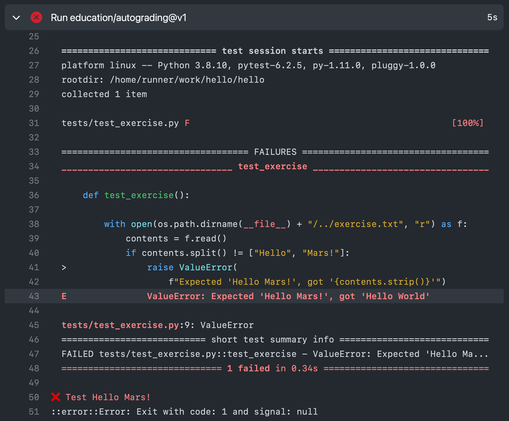

This is indeed very useful as the error tells us that the test was expecting
"Hello Mars!" but instead found "Hello World". This is clearly a trivial
example, however the tests provided with the exercises in this book also
attempt to provide useful feedback on what has gone wrong when a test is
failed.

Doing an exercise again
~~~~~~~~~~~~~~~~~~~~~~~

Sometimes, such as when you are revising for an exam by doing past papers, you 
might want to start again with a fresh template repository. Using Git, this can
be achieved by working on a new branch whose base is the commit before you
started your work. First, commit and push your existing work. Verify that you
have done so by running:

.. code-block:: console

    $ git status

The result should be something like:

.. code-block:: console

    On branch main
    Your branch is up to date with 'origin/main'.

    nothing to commit, working tree clean
   
If you don't see `nothing to commit` then commit your work. If you don't see
`up to date` then push.

If your repository comes from GitHub classroom then your
instructor may have set up a feedback branch for you, and you can use that as
your starting point. To see if this is the case, run:

.. code-block:: console

    $ git branch -a

If you see `remotes/origin/feedback` then you can simply use `feedback` as the
base for your new branch. If you don't have a feedback branch then you need to
search back through the history of your repository to find your first commit.
Run:

.. code-block:: console

    $ git log

and scroll back to find the last commit *before* your first commit. Copy the
commit hash. Now we're ready to create the new branch. You need to choose a new
name for your branch, which is not the same as any other branch name in this
repository. For example, if you choose the branch name `second_attempt` then
you would create the branch by typing:

.. code-block:: console

    $ git branch feedback second_attempt

If you don't have a `feedback` branch then you would instead use the commit
hash of the last commit before your work, which you found above by searching
the log.

You switch your working repository to the new branch using:

.. code-block:: console

    $ git checkout second_attempt

You could also switch back to your first attempt by running:

.. code-block:: console

    $ git checkout main

When you come to push your new work to GitHub, you will find that this fails
with a message such as:

.. code-block:: console

   fatal: The current branch second_attempt has no upstream branch.
   To push the current branch and set the remote as upstream, use

       git push --set-upstream origin second_attempt

   To have this happen automatically for branches without a tracking
   upstream, see 'push.autoSetupRemote' in 'git help config'.
    
Fortunately, this error message tells you exactly what to do, so run:

.. code-block:: console

    git push --set-upstream origin second_attempt

When you look at your repository on GitHub, the default display is for the main
branch. On the left near the top you will find a dropdown button that starts
with the name `main` (or `master` on old repositories). You use this to switch
branch.

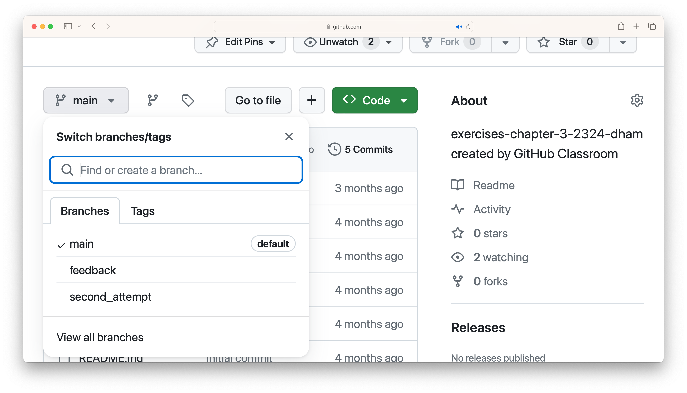

.. rubric:: Footnotes

.. [#swcarpentry] `http://swcarpentry.github.io/git-novice
    <http://swcarpentry.github.io/git-novice/>`_ 

.. [#swcarpentry_editor] `https://swcarpentry.github.io/git-novice/02-setup/
    <https://swcarpentry.github.io/git-novice/02-setup/>`

.. [#Chrome] To use these installation instructions for Chrome OS you first
    need to :ref:`set up Linux on your Chromebook <linux-chrome>`. 
